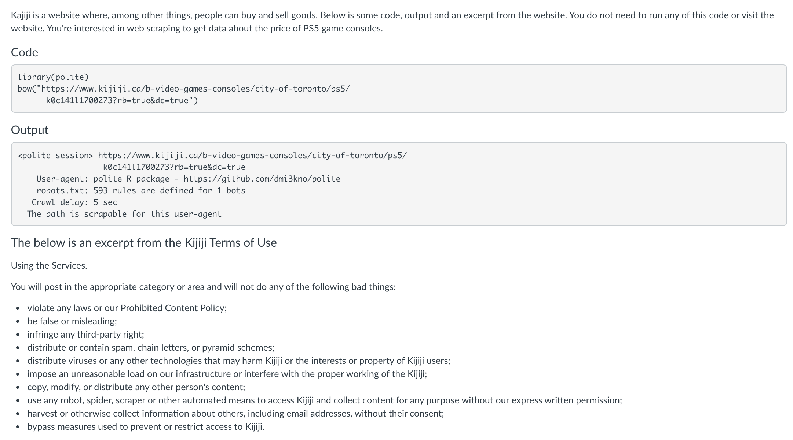
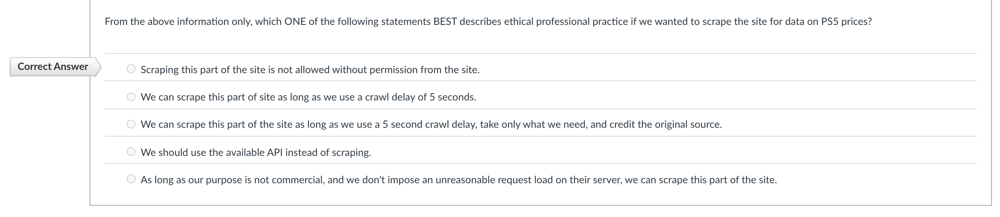
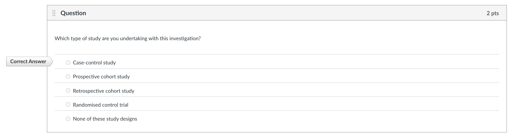
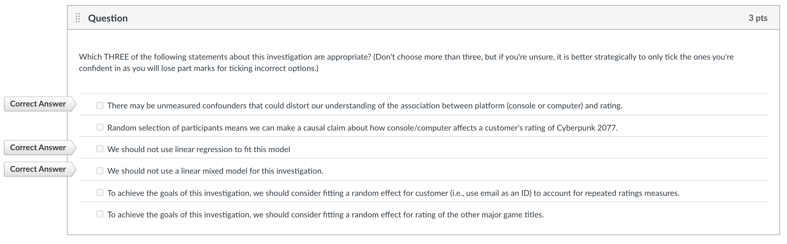
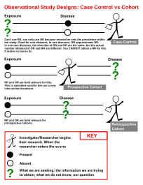
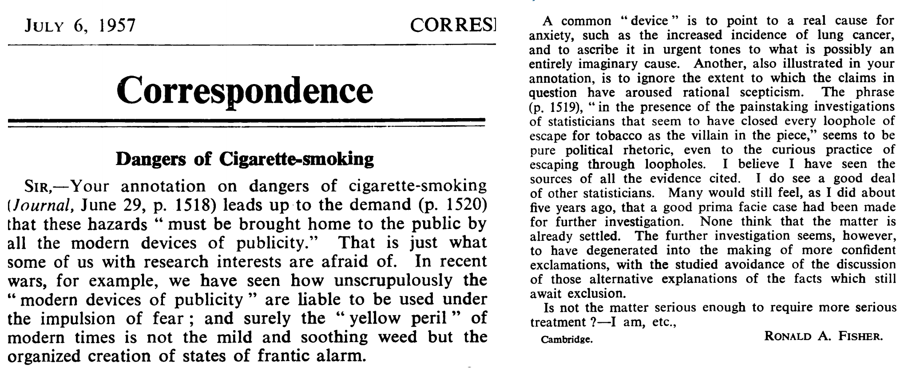
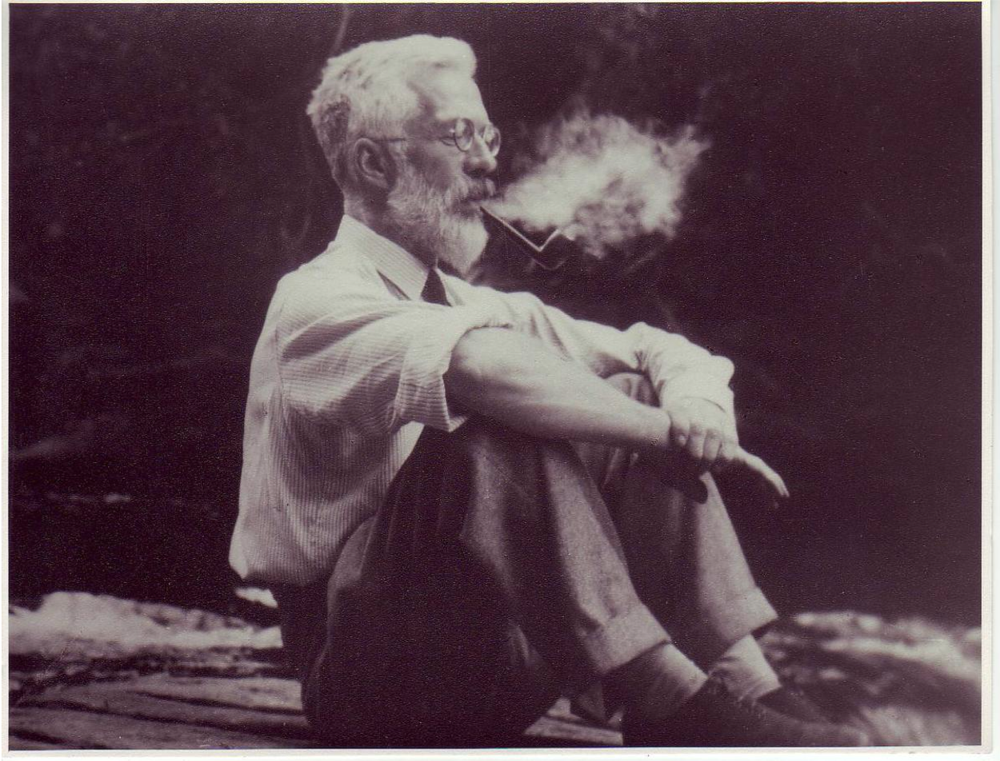

```{r setup, include=FALSE}
# R options
options(
  htmltools.dir.version = FALSE, # for blogdown
  show.signif.stars = FALSE,     # for regression output
  warm = 1,
  crayon.enabled = FALSE
  )
# Set dpi and height for images
library(knitr)
opts_chunk$set(fig.height = 2.65, dpi =300, warning=FALSE, message=FALSE) 
# ggplot2 color palette with gray
color_palette <- list(gray = "#999999", 
                      salmon = "#E69F00", 
                      lightblue = "#56B4E9", 
                      green = "#009E73", 
                      yellow = "#F0E442", 
                      darkblue = "#0072B2", 
                      red = "#D55E00", 
                      purple = "#CC79A7")

library(tidyverse)
library(gridExtra)
htmltools::tagList(rmarkdown::html_dependency_font_awesome())
### xaringan::inf_mr() -> use this for display within Rstudio

xaringanExtra::use_share_again()
xaringanExtra::style_share_again(
  share_buttons = "none"
)

htmltools::tagList(
  xaringanExtra::use_clipboard(
    button_text = "<i class=\"fa fa-clipboard\"></i>",
    success_text = "<i class=\"fa fa-check\" style=\"color: #90BE6D\"></i>",
    error_text = "<i class=\"fa fa-times-circle\" style=\"color: #F94144\"></i>"
  ),
  rmarkdown::html_dependency_font_awesome()
)
```

name: topics

## Topics
You can click the following links to navigate through the slides (in the HTML version).

* [Admin notes and response to the last check-in survey](#admin)
* [Generalized linear mixed models](#glmms)
* [College Basketball Ref case study + writing task: Methods sections](#writing)
* [Case control studies and conditional logistic regression](#condlog)

---
class: middle, center, inverse
name: admin
# Admin notes and response to the last check-in survey

.header[<u>[Go to topics list](#topics)</u>]

---
## Weekly check-in (week 8), your questions/clarifications:

### _"I was wondering what the reasoning was for using "fake" data for the final project and whether or not this weakens it as an example in a final portfolio"._

I think this is a good question. To get data at the individual level, that has features appropriate for what I want to assess you on and still have a 'consulting' style experience, this simulated data made a lot of sense. It is still 'data' with insights for you to find though, so not 'easier' or unrealistic. All that said, a lot of how it will be received in a portfolio is up to how YOU present it. You may also want to make sure you work on some other personal projects with real data to show you can, that there isn't a difference. TidyTuesday datasets are a great source for these.

### _Iteratively re-weighted least squares._

Remember that this isn't assessed in *this* course, just something useful to be aware of.

_Continued next page_

---
## Weekly check-in (week 8), your questions/clarifications:
### _Readings_

Remember to use your previewing and skimming techniques if you feel like readings are taking you a long time. As a strategy, make sure you're aware of the key points from the main slides and what your writing task will be for the week. From there you can make more informed choices about what to look for and focus on in the readings. Also pay attention to any specific section recommendations. 

For example, for this week, you will be asked to write up a __methods section__ for the College Basketball Referees example. 
AND, last but not least, folks would like generally __more practice with interpreting regression coefficients for Poisson and logistic regression__ + what the link functions are, which is great because we're doing more of that this week. (Also, the purpose of the range of readings in week 8.)

---
## Upcoming assessments: weekly 

* [Week 10 quiz](https://q.utoronto.ca/courses/204826/quizzes/138615) (.highlight[due Friday, Mar 26 at 6:00 p.m. ET])
* [Week 10 writing](https://q.utoronto.ca/courses/204826/assignments/506345)
    - Create phase due Mar 25 at 6:00 p.m. ET
    - Assess phase due Mar 26 at 6:00 p.m. ET
    - Reflect phase due Mar 29 at 6:00 p.m. ET
---
## Upcoming assessments: non-weekly 
.midi[
### Confirm project group/individual status (due Mar 23 at 6:00 p.m. ET)

You _may_ work in a group of up to 5 people, but think carefully if that is actually the right choice for you. [Form here.](https://forms.office.com/Pages/ResponsePage.aspx?id=JsKqeAMvTUuQN7RtVsVSEOKHUU3SzAJJhmOKjJhDWEpUQkZMMzJRMDlUMFBPTkk5N0xBMjdWRU9RUi4u) 

Get the data for the project: 
`devtools::install_github("sta303-bolton/sta303project")` (see the gif in [this announcement](https://q.utoronto.ca/courses/204826/discussion_topics/1138916))

### [Professional development evidence and reflection](https://q.utoronto.ca/courses/204826/assignments/506360) (due Apr 2 at 6:00 p.m. ET)

### [Polished writing 3](https://q.utoronto.ca/courses/204826/assignments/506354) (due Apr 9 at 6:00 p.m. ET)

[Polished writing 3](https://q.utoronto.ca/courses/204826/assignments/506354) must be a response to one of the prompts from Week 8, 9, 10 or 11. You do not have to have completed the activity for that week to be able to submit your response as your polished writing, but the intention is that you are submitting a piece improved based on feedback from your peers.
]

---
## Question 16 background
```{r, echo=FALSE, fig.align='center', out.width="75%"}

```

---
## Question 16

```{r, echo=FALSE, fig.align='center', out.width="100%"}

```

In the included information, we see that the Terms of Use says that no unauthorized scrapers can be used. There is also no mention of an API anywhere, and not all sites provide APIs, so you cannot assume there is one. Even though the `robots.txt` doesn't say anything, as ethical statisticians we need to heed to Terms of Use also.

---
## Question 17 & 18 background

```{r, echo=FALSE, fig.align='center', out.width="100%"}

```

---
## Question 17

```{r, echo=FALSE, fig.align='center', out.width="100%"}

```

This is a case-control study because outcome (review) is being sampled on.

---
## Question 18

```{r, echo=FALSE, fig.align='center', out.width="100%"}

```

The response is binary, so we would need a generalized linear model, NOT linear regression nor a linear mixed model. And we're almost always worried about unmeasured confounders.

---
class: middle, center, inverse
name: glmms
# Generalized linear mixed models

.header[<u>[Go to topics list](#topics)</u>]

---
# What models have we looked at so far?

* recapped linear regression + model matrices
* linear __mixed__ models
  * for when our observations aren't independent due to some sort of grouping
* __generalized__ linear models
  * for situations where linear models don't work because of the response type

## Next
- *generalized* linear mixed models  
  * when we shouldn't use LMMs because of the response
  * and we shouldn't use GLMs because of grouping/repeated measures in our data

---
### What were mixed effects, again?

We call these mixed effect models because they mix **fixed** effects (the way you're used to comparing the differences between treatments or effect of covariates) and **random** effects (generally experimental or observational blocks within which observations are grouped).

These types of models can be especially useful for people working with psychological, economic, social and ecological data.

---
## Generalized linear mixed models
.midi[
**Pros**
* Powerful class of models that combine the characteristics of generalized linear models (GLMs) and linear mixed models (LMMs)
* They can be used with a range of response distributions (e.g. Poisson, Binomial, Gamma)
* They can be used in a range of situations where observations are grouped in some way (not all independent)
* Fast and can be extended to handle somewhat more complex situations (e.g. zero-inflated Poisson)

**Cons**
* Some of the standard ways we've learned to test models don't apply
* Greater risk of making 'sensible' models that are too complex for our data to support

GLMMs are still under active development by statisticians so not all the answers are know (even by the experts working on them).
]

---
class: middle

# Activity

.question[Based on the assumptions for previous models we've considered in this course, what do you think the assumptions for GLMMs will be?]

---
### Assumptions

* Our units/subjects are independent, even through observations within each subject are taken not to to be. (Replace subjects with' groups', same idea.)

* Random effects come from a normal distribution.

* The random effects errors and within-unit residual errors have constant variance.  I.e. Are variances of data (transformed by the link
function) homogeneous across categories?

* The chosen link function is appropriate / the model is correctly specified.

---

## Activity

.pull-left[Here are the general model forms for the classes of models we've met so far.]

.pull-right[
.question[1.What are the similarities in each row?]
.question[2.What are the similarities in each column?]  
.question[3.What do they all have in common?]]

.midsmall[
.pull-left[
**Linear Model**

$$
\begin{aligned}
Y_{i} \sim & \text{N}(\mu_i, \sigma^2)\\
\mu_i = & X_i \beta
\end{aligned}
$$
<br>

**Generalized Linear Model**

$$
\begin{aligned}
Y_{i} \sim & \text{G}(\mu_i, \theta)\\
h(\mu_i) = & X_i \beta
\end{aligned}
$$
]
.pull-right[
**Linear Mixed Model**

$$
\begin{aligned}
Y_{ij}|U \sim & \text{N}(\mu_{ij}, \sigma^2)\\
\mu_{ij} = & X_{ij} \beta + U_i\\
U \sim & \text{MVN}(0, \Sigma)
\end{aligned}
$$

<br>
**Generalized Linear Mixed Model**

$$
\begin{aligned}
Y_{ij}|U \sim & \text{G}(\mu_{ij}, \theta)\\
h(\mu_{ij}) = & X_{ij} \beta + U_i\\
U \sim & \text{MVN}(0, \Sigma)
\end{aligned}
$$
]]

---
## Example: Bacteria in blood samples 🦠💉

.pull-left[
```{r  echo=TRUE}
# Data comes from the MASS package
data(bacteria, package='MASS')
head(bacteria)
```
]

.pull-right[


- `y` is presence or absence of a certain bacteria in a blood sample
- `ID` is the subject the sample came from
- `ap` represents the treatment variable,  with levels 'p' for placebo and 'a' for active.
- `week`, either 0, 2, 4, 6, or 11 indicates the number of weeks since the first test.
- **The Question:** does the treatment reduce the probability of bacteria in the sample?
- **The complication:** data are not independent.  Some people are more
susceptible than others.
]
 
---

## A model

.pull-left[
\begin{align*}
Y_{it} \sim & \text{Bernoulli}(\rho_{it})\\
\text{logit}(\rho_{it}) = & \mu + X_{it} \beta + U_i\\
U_i \sim & \text{N}(0, \sigma^2)
\end{align*}

]


.pull-right[

- $Y_{it}$ is presence of bacteria in individual $i$ at time $t$
- $X_{it}$ has indicator variables for week and treatment type.
- $U_i$ is an individual-level *random effect*.
- $U_i > 0$ if $i$ is more likely than the average to have the bacteria
   (allows for within-individual dependence)
- This is a *Generalized Linear Mixed Model* (GLMM)

]


---
## Inference for GLMMs

- We know the probabilities of the $Y_{it}$ conditional on the random effects

$$pr(Y_{it} | U_i;\mu,\beta) = \frac{\exp(X_{it} + U_i)}{1+\exp(X_{it} + U_i)}$$
- If we knew the $U_i$, maximize the above to estimate $\hat\beta$
- Integrate out the unknown $U_i$!
$$
	pr(Y;\mu,\beta,\sigma) = \int	pr(Y | U; \mu,\beta) pr(U;\sigma) dU
$$
writing $U =[U_1 \ldots U_N]$
- Maximize the above to get $\hat\mu$, $\hat\beta$, $\hat{\theta}$
- Plug-in parameter MLEs when predicting $U_i$
$$
\text{E}(U_i |Y; \hat{\mu},\hat{\beta}, \hat{\sigma})
$$

 
---
## Problems with Likelihood that affect our inference for GLMMs

.pull-left[
**~7 years ago:**

- We couldn't evaluate the likelihood, let alone maximize it
- There were approximate methods which get around this
    - Generalized Estimating Equations
    - Penalized Quasi-likelihood
    - Hierarchical Likelihood (Lee and Nelder)
- They could provide good parameter estimates and standard errors for the $\beta$ but could be poor at finding $\text{var}(U_i | Y)$.
- `proc glmix` in SAS, `glmmPQL` in R.
]

.pull-right[
**Today**

- Frequentist methods were later to arrive than Bayesian ones
- now they're here: Laplace approximations, importance sampling, automatic differentiation
- `lme4`, `glmmTMB`, `prevmap`
]

---
## Exploring bacteria data

```{r}
# How many children?
length(unique(bacteria$ID))

# How many weeks?
table(bacteria$week)

# Were all children tested each week?
table(bacteria$week)/50

# How many in each group?
bacteria %>% 
  group_by(ID) %>% 
  slice(1) %>% 
  group_by(ap) %>% 
  summarise(n = n())

```

---
## Fitting a model with `lme4`

.pull-left[
Create a new binary variable `y`:
```{r echo=TRUE}
bacteria$newy = as.integer(bacteria$y=='y')
```
Set treatment variable to placebo for everyone at week zero:
```{r echo=TRUE}
bacteria$ap[bacteria$week == 0] = 'p'
```
]

.pull-right[

Set placebo to be the baseline:
```{r echo=TRUE}
bacteria$ap = fct_relevel(bacteria$ap, "p")
```

Run the model:
```{r pqlbac,echo=TRUE, result='hide', message=FALSE}
#install.packages("lme4")
bRes = lme4::glmer(newy ~ factor(week) + ap + (1 | ID), 
		family='binomial', data=bacteria)
```
]

---
## Parameter estimates

```{r pqlbacshow, eval=TRUE, echo=TRUE}
bRes = lme4::glmer(newy ~ factor(week) + ap + (1 | ID), 
		family='binomial', data=bacteria)
```

```{r pqlbacCoef,echo=TRUE}
lme4::VarCorr(bRes)
round(summary(bRes)$coef, digits=2)
```

---
## Confidence intervals

- This takes a long time to run 
- ...it is computing profile likelihoods


```{r bacConfint, echo=TRUE, cache=TRUE, stuff=1}
(bConfint = confint(bRes))
```

---
## Prepare a table for reporting (1)

```{r}
# Get the estimates transformed
ests <- format(round(exp(summary(bRes)$coeff)[,1], 2), nsmall = 2)
ests

# Get your confidence intervals
cis <- format(round(exp(bConfint),2)[-1,], nsmall = 2)
cis
```

---
## Prepare a table for reporting (2)

```{r}
## But make even prettier
cis_pretty <- str_c("(", trimws(cis[,1]), ", ", cis[,2], ")")
cis_pretty

# What are the nice names for the rows and columns?
rownames_for_table <- c("Baseline odds", "Week 2", "Week 4", "Week 6", "Week 11", "Active treatment")
colnames_for_table <- c("Estimate", "95% CI")

my_pretty_table <- cbind(ests, cis_pretty)
rownames(my_pretty_table) <- rownames_for_table
colnames(my_pretty_table) <- colnames_for_table
```

```{r, echo=TRUE, eval=FALSE}
knitr::kable(my_pretty_table, align = c("r", "r"))
```

---
## Pulling it all together: A short description of the methods (model written out previously)

This study investigates the association between an active treatment and the presence or absence of _H. influenzae_ in children with otitis media in the Northern Territory of Australia. Children were randomly assigned to take either a placebo or drug after the baseline tests at week 0. 50 children were involved in the study (29 in treatment group, 21 in the placebo group) with blood tests conducted at 0, 2, 4, 6 and 11 weeks of treatment. Not all children were tested at all checks, but at least 80% were tested at any given check.

Our outcome of interest was the presence or absence of the bacteria and our predictors were week, treated as a factor, and whether the child was in that active treatment or placebo group. As there were repeated measures for each child, a generalized linear mixed model with logit link was used and random intercepts were estimated for each child.


.tiny[Menzies School of Health Research 1999–2000 Annual Report. p.20. http://www.menzies.edu.au/icms_docs/172302_2000_Annual_report.pdf.]

---
## Pulling it all together: Results

.pull-left[
The odds of there being bacteria in a blood sample at week 0 are roughly 16:1. Recall that all children are represented in the baseline as everyone was set as receiving the 'placebo' at week 0, i.e., no active treatment _before_ treatment started.

Children receiving the treatment had 71% lower odds (95% confidence interval from 7 to 92% lower odds) of having bacteria present in the subsequent tests. There was no significant change in odds of finding bacteria in a child's blood test from week to week.
]

.pull-right[
```{r bacteriatable, echo=FALSE, results='asis'}
knitr::kable(my_pretty_table, align = c("r", "r"))
```
]

---
## Generalized Linear Mixed Models

.pull-left[

$$
\begin{aligned}
Y_i \sim &\pi(\lambda_i; \theta)\\
\lambda_i = & h(\eta_i) \\
\eta_i = & \mu + W_i \beta + U_i\\
U \sim & \text{MVN}[0,\Sigma(\theta)]
\end{aligned}
$$
]

.pull-right[

- The bacteria model has 

    - $\theta = \sigma$
    - $\Sigma(\theta) = \sigma^2 I$
    - $h(x) = \log(x)$
    - $\pi(\eta_i; \theta) = \text{Bernoulli}(\lambda_i)$
- The dimension of $U$ and sometimes $\beta$ is very large,
- Whereas typically the number of elements in $\theta$ is small.

(MVN is multivariate normal) 
]

---
## Conclusions

- GLMMs are easy to fit (thanks to Taylor series/Gaussian approximations, which we're not covering here)
- Interpreting GLMMs is similar to interpreting GLMs
- ... link function makes interpretation subtle
- personal preference dictates whether to use `glmmTMB` or `lme4::glmer` 
- ... `glmmTMB` is faster on large datasets
-  Be Bayesian if you wish, but Frequentist GLMMs are a feasible and convenient option

---
class: middle, center, inverse
name: writing
# College Basketball Referees + writing task: Methods section

.header[<u>[Go to topics list](#topics)</u>]

---
## Writing a methods section

In Week 5, you wrote the results and conclusion for an abstract for the lung function study. In Week 8 you wrote the __full abstract__ for the [weekend drinking case study](https://bookdown.org/roback/bookdown-BeyondMLR/ch-poissonreg.html#cs:drinking) in Roback and Legler, and then in Week 9 you wrote an executive summary for the same study. 

These tasks are meant to help prepare you for future academic and industry writing in general, but also to specifically prepare you for the final project. In this vein, this week we will practice writing a brief methods section for the College Basketball Coach case study.

[See the prompt for more information about writing up methods.](https://q.utoronto.ca/courses/204826/assignments/506347)

---
class: middle, center, inverse
name: condlog
# Case control studies and conditional logistic regressions

.header[<u>[Go to topics list](#topics)</u>]

---
## Study designs

In __cohort studies__, we think of the predictors being fixed and what we sample on, while the outcome is the random variable to be observed (though whether or not the outcome occurs before or after the researcher gets involved makes it prospective vs retrospective).

In __case-control studies__, it is the _outcome_ that is the fixed variable on which we sample and it is the predictors that we're then observing. An important feature for this study type: the probability that someone/something is included in the study must be independent of the predictors.  

Making these distinctions is important for what we will be able to conclude from our investigation. 

---

### Let's travel back to the Nifty Fifties...

```{r, echo=FALSE, fig.align='center', out.width="80%"}

```

---
class: middle

## What causes lung cancer?

"phenomenal increase in in the number of deaths attributed to cancer od fhe lung" ... "Two main causes...put forward: (1) general atmospheric pollution... (2) the smoking of tobacco."

```{r, echo=FALSE, fig.align='center', out.width="70%"}
knitr::include_graphics("libs/images/w10/dollarticle.png")
```

---

## The problem

.pull-left[
.midi[
**What's the effect of smoking on cancer?**
- *Cohort Study*:
    - Recruit 1000 *smokers* and 1000 *non-smokers*, 
    - Follow them for 50 years
    - How many more cancers in the smoking group?
- *Case Control Study*:
    - Recruit 1000 people with *cancer* and 1000 *healthy* people
    - How many more smokers in the cancer group?

What can the case control study tell us that's useful?
]]

.pull-right[


.footnote[ [Link to Doll article from 1950](https://www.ncbi.nlm.nih.gov/pmc/articles/PMC2038856/pdf/brmedj03566-0003.pdf) ]]

---
.center[

]

.footnote[https://commons.wikimedia.org/wiki/File:ExplainingCaseControlSJW-en.svg#file]

---
## Our data

.pull-left[
```{r dollAnalysis, echo=TRUE, eval=FALSE, tidy=FALSE}
dat = data.frame(
  smoke= factor(c(0, 1,5,15,25,50)),
  cases = c(2,24, 208,196,174,45),
  controls = c(27,38,242,201,118, 23)
  )
dat$odds = dat$cases / dat$controls

dat$OR = dat$odds/(dat$odds[1])
knitr::kable(dat, digits=1, format="html")
```
]

.pull-right[
```{r dollAnalysis, echo=FALSE, eval=TRUE}
```

Note: Odds ratios for smoking _given_ cancer, not cancer _given_ smoking!

_"If you have cancer, you have 8.5x higher odds of having been a 1-a-day smoker than being a non-smoker._

]

---
## Fisher was not a fan...

Sir Ronald Aylmer Fisher, the man behind maximum likelihoods and "father" of a lot of the statistics you have learned in your undergrad didn't think the Doll and Hill article was any good.



.footnote[Optional: [Why the father of modern statistics didn't believe smoking caused cancer](https://priceonomics.com/why-the-father-of-modern-statistics-didnt-believe/)]

---
## Fisher smoking a pipe

.center[

]

---
## Baby feeding type example (focussing on assigned male at birth infants): Page 1

.pull-left[
```{r}
#install.packages(faraway)
library(faraway)
knitr::kable(babyfood[c(1,3),])
```


.footnote[Section 2.6 of Faraway, J. (2005). Extending the Linear Model with R. New York: Chapman and Hall/CRC, https://doi-org.myaccess.library.utoronto.ca/10.1201/b15416]
]

.pull-right[

1. Given an infant is bottle fed, what are the log-odds of having a respiratory disease?

1. Given an infant is breast fed, what are the log-odds of having a respiratory disease?

1. What is the difference between these two log odds?
]

---
## Baby feeding type example (focussing on assigned male at birth infants): Page 2

.pull-left[
```{r}
#install.packages(faraway)
library(faraway)
knitr::kable(babyfood[c(1,3),])
```


.tiny[.footnote[Section 2.6 of Faraway, J. (2005). Extending the Linear Model with R. New York: Chapman and Hall/CRC, https://doi-org.myaccess.library.utoronto.ca/10.1201/b15416]]
]

.pull-right[

4. Given an infant has a respiratory disease, what are the log-odds of having been bottle fed?

5. Given an infant doesn't have a respiratory disease, what are the log-odds of having been bottle fed?

6. What is the difference between these two log odds?

7. What do you notice about 3. and 6.?
]

---

## A convenient result

- $X_i$, $Y_i$, $Z_i$ are the smoking status, cancer status, and 'in the study' indicators respectively.
- We want $P(Y_i = y | X_i = x)$.
- Modelling the case-control data gives us $P(Y_i = y | X_i = x, Z_i= 1)$
- It turns out that
$$
\frac{\text{odds}(Y_i | X_i = x_1, Z_i = 1)}{\text{odds}(Y_i | X_i = x_0, Z_i = 1)} 
$$

is the same as

$$
\frac{\text{odds}(Y_i  | X_i = x_1)}{\text{odds}(Y_i  | X_i = x_0)} 
$$

---

### Proof

$Y$ cancer, $X$ smoking, $Z$ in study

\begin{align*}
P(Y_i | X_i, Z_i = 1 ) = & P( Y_i, Z_i =1 | X_i) / P( Z_i = 1 | X_i)  \\
= &  P(Z_i =1 | Y_i, X_i) P(Y_i | X_i) / P( Z_i = 1 | X_i) 
\end{align*}

Assume $Z_i$ is independent of $X_i$ given $Y_i$

\begin{align*}
P(Y_i | X_i, Z_i = 1 ) = &  
  P(Y_i | X_i) \cdot P(Z_i =1 | Y_i)  / P( Z_i = 1 | X_i) \\
 \frac{P(Y_i =1 | X_i, Z_i = 1 ) }{ P(Y_i = 0 | X_i, Z_i = 1 ) } = &  
 \frac{P(Y_i =1 | X_i) }{P(Y_i = 0 | X_i)  } \cdot 
 \frac{P(Z_i =1 | Y_i =1) }{P(Z_i = 1 | Y_i =0 )  } \\
 \log\text{odds}(Y_i | X_i, Z_i = 1 ) = & \log\text{odds}(Y_i | X_i)  + C
\end{align*}


---
### Assumptions

$$P(Z_i|Y_i, X_i) = P(Z_i | Y_i)$$ 

- inclusion in the study doesn't depend on covariates _only_ on disease status
- this would be violated if healthy smokers were hard to recruit

    - smokers would be underrepresented in the controls
    - ...and we'd over-estimate the smoking/cancer effect
- or if smokers were worried about cancer and were easy to recruit

    - smokers would be over-represented in controls
    - ...and we'd underestimate smoking-cancer effects

---

### The big problems with case control studies

People don't answer the phone anymore...so controls are hard to recruit.

Controls have personal reasons for wanting to be in the study  
  - ... such as a family history of lung cancer  
  - ... or worries about lung cancer because they smoke heavily  

---
## Predicting cervical Spine Injury (CSI) in children

[www.pecarn.org/studyDatasets/PUD?studyID=6](http://www.pecarn.org/studyDatasets/PUD?studyID=6)

"We conducted a case-control study of children younger than 16 years, presenting after blunt trauma,
and who received cervical spine radiographs at 17 hospitals in the Pediatric Emergency Care Applied Research
Network (PECARN) between January 2000 and December 2004. Cases were children with cervical spine injury.

Children with Current Procedural Terminology codes
for cervical spine radiography but without ICD-9 codes for
cervical spine injury were identified as potential controls."

---
### The Data

```{r vteData, echo=TRUE}
x <- read_csv("data/w10/analysisvariables.csv")

x$response = as.numeric(x$ControlType == 'case')
xSub = x[x$ControlType %in% c("case","ran"),]
table(xSub$ControlType)

```

---

### Matched case-control studies

.midi[
We commonly have multiple controls matched to each case based on some parameters of interest, like sex or age. We talk about each set of case and control matches as a _stratum_.  We're doing this to try to control for confounding. We can use good ol' logistic regression with a constant term for each stratum, in some cases, to get an okay estimate if we have only a small number of strata, but if you're wanting to create many strata, e.g. to account for several combinations of possible confounders, then logistic regression won't be suitable.

So what can we do? We can instead condition on the number of cases in each stratum, creating a _conditional_ likelihood. (This lets us avoid estimating constants for each strata. Math for this in STA442, depending who is teaching.)

The `clogit` function in the `survival` package will maximize this conditional likelihood for us.]

.small[(Fun fact: The log likelihood for a conditional logistic regression model is the same as the log likelihood for Cox model (with a particular data structure). Cox is a popular modelling approach for survival analysis.)]

---
### The spine study

For cases receiving emergency medical services (EMS) out-of-hospital care, a
control group matched on age who had also received EMS out-of-hospital care ("EMS controls"). For each control group, we selected up to 2 controls per case to enhance the power of identifying risk factors.

```{r cctype, echo=TRUE}
table(x$ControlType)
```

---
### The data

```{r cctypeSub, echo=TRUE}
xSubM = as.data.frame(x[x$ControlType %in% c('case','ems'),])
xSubM[xSubM$CaseID %in%  xSubM$CaseID[1:2],c('CaseID','ControlType','StudySubjectID')]
```

---
## Matched case-control logistic regression

```{r clogit, echo=TRUE, eval=FALSE}
library('survival')
resC = clogit(response ~ Predisposed + AlteredMentalStatus + AxialLoadAnyDoc +
 HighriskMVC + HighriskHitByCar + HighriskDiving + Clotheslining +
strata(CaseID), data=xSubM)
knitr::kable(summary(resC)$coef, digits=2, format='html')
```

Table on next page.

---
### Matched case-control logistic regression

```{r clogit, echo=FALSE}
```

---
### Notes

- the spine data isn't *true* case-control
- controls are still injured
- random samples of healthy people are impossible to obtain
- **case-only studies** are increasingly common

---

## Conclusions   

- Case-control studies are useful
- They can modelled in (mostly) the same way as cohort studies
- Subject to assumptions (like everything in Stats)

---
class: inverse, middle

# See you Wednesday for class!

.header[<u>[Go to topics list](#topics)</u>]

```{r eval = FALSE, echo = FALSE}

pagedown::chrome_print("sta303_w10_slides.html", wait = 20)

```
