```{r setup, include=FALSE}
# R options
options(
  htmltools.dir.version = FALSE, # for blogdown
  show.signif.stars = FALSE,     # for regression output
  warm = 1,
  crayon.enabled = FALSE
  )
# Set dpi and height for images
library(knitr)
opts_chunk$set(fig.height = 2.65, dpi =300, warning=FALSE, message=FALSE) 
# ggplot2 color palette with gray
color_palette <- list(gray = "#999999", 
                      salmon = "#E69F00", 
                      lightblue = "#56B4E9", 
                      green = "#009E73", 
                      yellow = "#F0E442", 
                      darkblue = "#0072B2", 
                      red = "#D55E00", 
                      purple = "#CC79A7")
# For nonsese...
#library(mdsr)
#library(emo)
library(tidyverse)
#library(gridExtra)
htmltools::tagList(rmarkdown::html_dependency_font_awesome())
### xaringan::inf_mr() -> use this for display within Rstudio

xaringanExtra::use_share_again()
xaringanExtra::style_share_again(
  share_buttons = "none"
)

htmltools::tagList(
  xaringanExtra::use_clipboard(
    button_text = "<i class=\"fa fa-clipboard\"></i>",
    success_text = "<i class=\"fa fa-check\" style=\"color: #90BE6D\"></i>",
    error_text = "<i class=\"fa fa-times-circle\" style=\"color: #F94144\"></i>"
  ),
  rmarkdown::html_dependency_font_awesome()
)
```

name: topics

## Topics
You can click the following links to navigate through the slides.

* [Follow-ups from the check-in survey](#admin)
* [Introduction to Week 3 topics](#intro)
* [Getting data](#get)
* [Analyzing data](#analyse)
* [Making decisions with data](#decisions)
* [Statistical communication](#comms)
* [Reading strategy: Previewing and skimming](#reading)

---
class: middle, center, inverse
name: admin
# Follow-ups from the check-in survey

.header[<u>[Go to topics list](#topics)</u>]

---
## Thank you for completing the end-of-week check-in!

+ __Week 2's content was loooong.__ I totally agree! I'm hoping this week feels a little lighter. The quiz was shorter last week to try to help reduce the workload a bit, too, but I definitely know that depending on your previous R experience, that was a full-on week. I do think it was important to get us on mostly the same page for the rest of the course (and for the data exploration assessment).
+ __Practice problems before the quiz?__ With the 'best 7 of 10' policy and low overall weight of the quizzes, I think of them as 'rewarded practice problems' already. In some weeks there will be interactives to play with as part of the modules that may have some elements of ungraded practice.
+ __What was the Week 2 quiz average?__ 72%, which seems about right for the purpose and intention of these quizzes. Good job!
+ __JupyterHub 403 error.__ I've been getting this, too. It appears to be resolved by refreshing the page, but I have also let the JupyterHub team know. 

---
## End-of-week check-in (cont.)

+ __Videos for the module.__ I've seen a few questions that suggest to me some folks have missed that there are usually several videos released with each module. Make sure you pay attention to the notes on the Outcomes and activities page for each module.
  - I also ran a poll to see if the general preference was a single video each week, or separated by topic. The overwhelming winner was videos separated by topic, which I think is a wise choice.  
  - I usually release a video to accompany each major topic and/or to demo code, but I will still sometimes assign you to just read a slide or two if everything I want to say is on them and the segment is short.
+ __Joins.__ I put an [(optional) additional interactive on joins](https://jupyter.utoronto.ca/hub/user-redirect/git-pull?repo=https%3A%2F%2Fgithub.com%2Fsta303-bolton%2Fsta303_activities&urlpath=shiny%2Fsta303_activities%2Finst%2Ftutorials%2Fw2_joins-opt%2F&branch=main) in the [Week 2 module](https://q.utoronto.ca/courses/204826/modules/418258) if you'd like to play around with them to build your intuitions further.

.footnote[Didn't do the check-in? Look out for future ones in the Friday end-of-week wrap-up 🎁.]

---
class: middle 

## 🔥 Tip: Course overview link now in main navigation menu

```{r, echo=FALSE, fig.align='center', out.width="90%"}
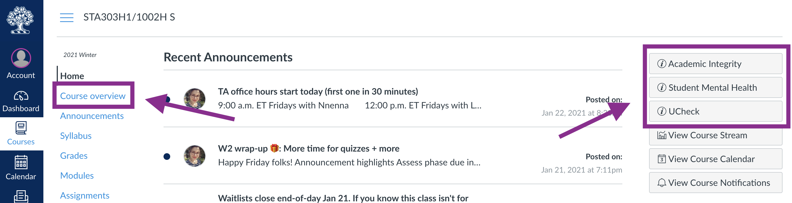
```

There are also links to Academic Integrity and Mental Health resources available from the Home page. 

---
## Upcoming assessments
 
## Weekly

* [Week 2 writing Reflect phase](https://q.utoronto.ca/courses/204826/assignments/506340) (due Jan 25 at 6:00 p.m. ET)
* [Week 1 quiz](https://q.utoronto.ca/courses/204826/assignments/506321) (due Wednesday, 27 at 10:00 a.m. ET)
* [Week 3 quiz](https://q.utoronto.ca/courses/204826/quizzes/138610) (due Wednesday, 27 at 10:00 a.m. ET)
* [Week 3 writing](https://q.utoronto.ca/courses/204826/assignments/506341)
    - Create phase due Jan 28 at 6:00 p.m. ET
    - Assess phase due Jan 29 at 6:00 p.m. ET
    - Reflect phase due Feb 1 at 6:00 p.m. ET

## Not weekly
* [Professional development task](https://q.utoronto.ca/courses/204826/assignments/506359): proposal (due .highlight[Friday, Jan 29 at 6:00 p.m. ET])
* [Polished writing 1](https://q.utoronto.ca/courses/204826/assignments/506351) (due Friday, Feb 5 at 6:00 p.m. ET)
* [Data exploration assessment](https://q.utoronto.ca/courses/204826/assignments/415115) (due Friday, Feb 12 at 6:00 p.m. ET)

---
class: middle, center, inverse
name: intro
# Introduction to Week 3 topics

.header[<u>[Go to topics list](#topics)</u>]

---
class: middle

This week's module introduces or recaps a range of ideas about professional practice for statisticians. Think of this week as just a very high-level survey of these ideas; we aren't going very deep on any of them, but some will set up conversations/tasks later in the course.

+ We'll revisit some of these concepts in later classes, like __case-control studies__ and logistic regression, __black box algorithms__ (very briefly) when we discuss GAMs and issues of confounding, proxies and ethical sourcing of data, throughout.
+ We'll touch on __web scraping__ in the Team Up! activity this week (all going to plan).
+ The __communication__ section will become more relevant when you start working on the project.

Folks who have taken or TAed STA130 might be more familiar with some of these concepts than others, but I'm not assuming much prior knowledge.

---
## Ethical codes for statisticians / data scientists

As ethical statisticians it is important to:
+ be accurate in our analyses and conclusions
+ be alert to possible consequences of our results/recommendations on others
+ be honest in reporting results, even when we don't get the results we hoped for
+ be respectful of other reasonable results (based on well-conducted research) even if they differ from our own
+ share credit when our work is based on the ideas of others
+ and more...

.midsmall[
__Optional reading__

__Statistical Society of Canada:__ https://ssc.ca/sites/default/files/data/Members/public/Accreditation/ethics_e.pdf  
__American Statistical Association:__  https://www.amstat.org/ASA/Your-Career/Ethical-Guidelines-for-Statistical-Practice.aspx
]

---
class: middle, center, inverse
name: get
# Getting data

.header[<u>[Go to topics list](#topics)</u>]

---
class: middle
## Getting data topics

* Confounding and study design
* Human research ethics
* Web scraping and APIs
* Indigenous data sovereignty
* Selection bias

---
class: middle
## Confounding and study design

---
## Confounding and study design

```{r, echo=FALSE, fig.align='center', out.width="70%"}
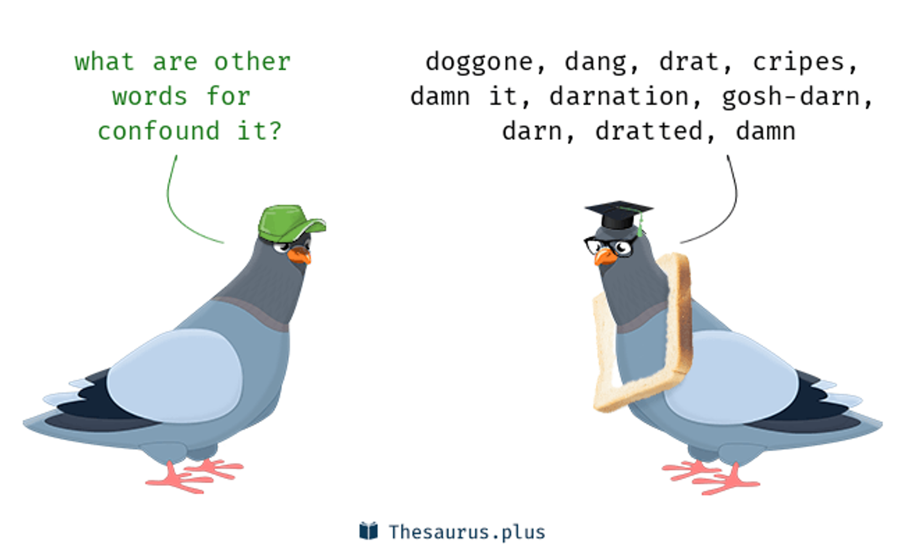
```

---
### Confounders (i.e. confounding factors or confounding variables)

```{r, echo=FALSE, fig.align='center', out.width="100%"}
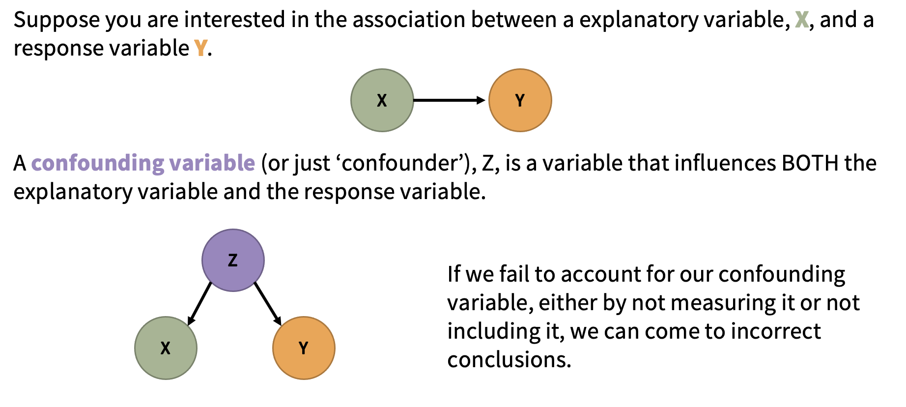
```

---

### Confounders (i.e. confounding factors or confounding variables)

In an **observational study**, variables are "observed" (measured and recorded) without manipulation of variables or conditions by the researcher.

Two variables are **confounded** if their effects on the response variable are mixed together and there is no way to separate them out. If this is the case, we have no way of determining which variable is causing changes to the response.

There is no 'test' for confounding. But this is a great thing if you don't want the robots to take your job anytime soon. We need smart people who can think well about confounding.

**When we have data from an observational study, we can only conclude association between variables, not causation.**


---

```{r, echo=FALSE, fig.align='center', out.width="70%"}
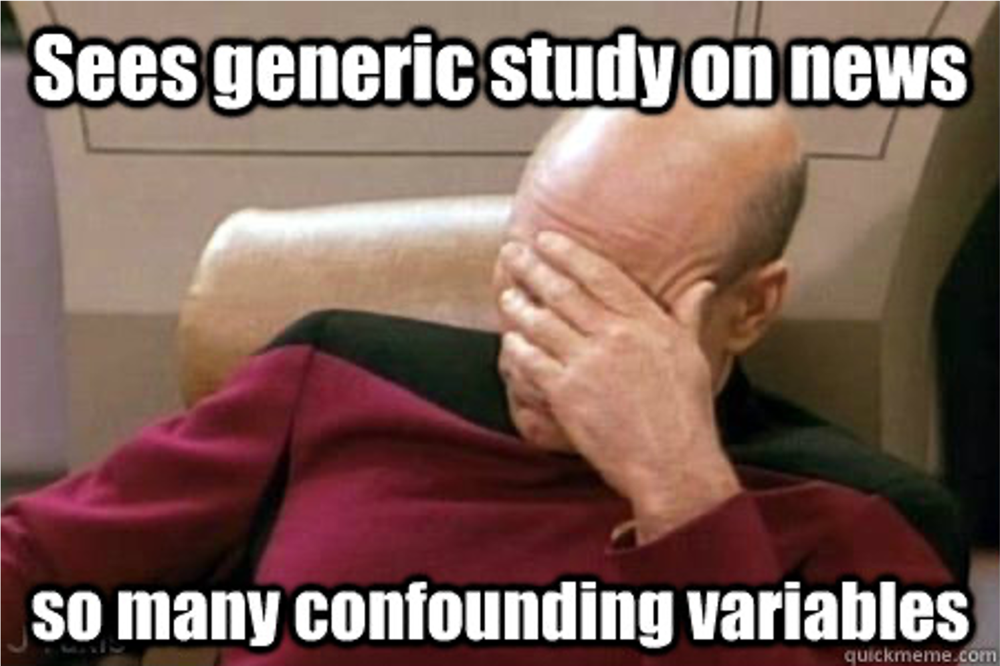
```

---
class: middle

## So, do we give up on claiming causation?

--

</br>
## No!

---

```{r, echo=FALSE, fig.align='center', out.width="65%"}
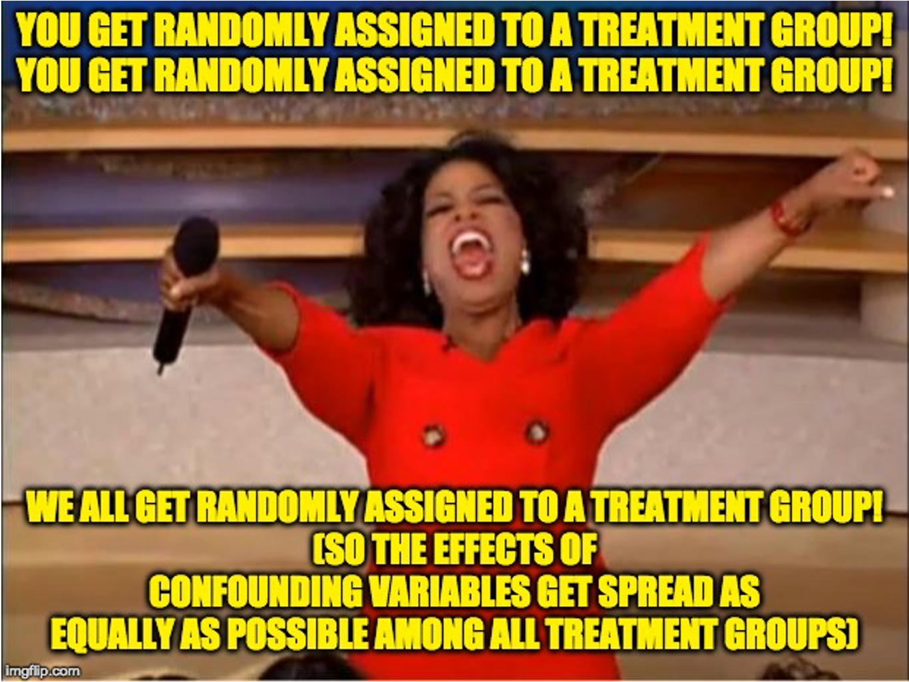
```

---
## Designing studies to avoid confounding

In an **experiment** (or __randomized trial__ or __randomized control trial__) variables and/or conditions are manipulated by the researcher and the impact on other variable(s) is measured and recorded.

The key is to randomly assign some individuals to one treatment (or condition) and randomly assign others to another treatment (sometimes this other treatment is a __control__) _Note: you can have more than two treatments groups too—what is important is that individuals are randomly assigned to them!_

The groups (before treatments are applied) should be very similar to each other with respect to the other variables. Any differences between individuals in the treatment and control groups would just be due to random chance!

If there is a __significant difference__ in the __outcome__ between the two groups, we may have evidence that there is a __causal relationship__ between the treatment and the outcome.

---
## Study designs 

```{r, echo=FALSE, fig.align='center', out.width="45%"}
include_graphics("libs/images/w3/studies.png")
```

---
## Causation from observational studies?

Although well-designed randomized trials are the best way to establish a causal
relationship, observational studies can also help build __evidence__ for causation.

.pull-left[
#### Bradford Hill criteria (not assessed)

.midi[
+ Strength of association
+ Consistency
+ Specificity
+ Temporality
+ Biological gradient
+ Plausibility
+ Coherence
+ Experiment
+ Analogy]
]

.pull-right[
> .midsmall[Science is not a magic wand that turns everything it touches to truth. Instead, “science operates as a procedure of uncertainty reduction,” said Nosek, of the Center for Open Science. “The goal is to get less wrong over time.” This concept is fundamental — whatever we know now is only our best approximation of the truth. We can never presume to have everything right.

From the _Science isn't broken_ reading his week (Aschwanden, 2015).
]
]

---

```{r, echo=FALSE, fig.align='center', out.width="90%"}
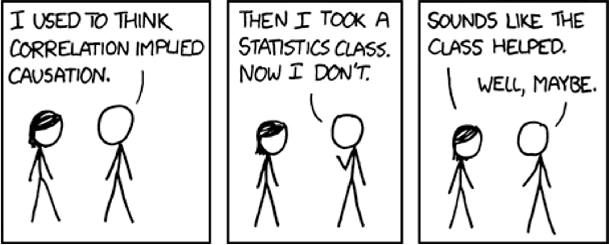
```

.footnote[https://xkcd.com/552/]

---
class: middle
## Human research ethics

---
## Human research ethics

Ethical codes often emerge out of crisis events.

The Nuremberg code was formulated in August 1947 in Nuremberg, Germany, by American judges sitting in judgement of Nazi doctors accused of conducting murderous and torturous human experiments in concentration camps during the war.

The Nuremberg code codified many of our standard principles of ethical research, including:
+ research must appropriately balance risk and potential benefits
+ researchers must be well-versed in their discipline and ground human experiments in animal trials.

.footnote[Did this judgement mean Americans were always getting research ethics right? Definitely not. Optional: [YouTube video about the Tuskegee Study](https://www.youtube.com/watch?v=afwK2CVpc9E) ]

---
## Principles of free and informed consent

__Information__: The research procedure, risks and anticipated benefits, alternative procedures (where therapy is involved), and a statement offering the participant the opportunity to ask questions and to withdraw at any time from the research.

__Comprehension__: The manner and context in which information is conveyed is as important as the information itself. For example, presenting information in a disorganized or rapid manner (with too little time to think about it or ask questions), may limit a participant's ability to make an informed choice.

__Voluntariness__: An agreement to participate in research constitutes a valid consent only if it is voluntary; this requires conditions free of coercion and inappropriate influence.

---
class: middle

## Web scraping and APIs

---
## Web scraping and APIs

Web scraping (also known as web harvesting, web crawling or web data extraction) is any method of copying data from a webpage, usually to then store it in a spreadsheet or database.

Downloading a ready-made .csv file hosted by a site wouldn't be considered web scraping. (Although you might find a programmatic way to download many of these could be.)

### What do you need to web scrape?

+ Some knowledge of URLs, HTML and CSS
  + URL - Universal Resource Locator
  + HTML - HyperText Markup Language
  + CSS - Cascading Style Sheets
+ The `rvest` and `polite` packages in R (or `Rcrawler`, there may be others too) or `Beautiful Soup` for Python
+ Professional ethics!

---

```{r, echo=FALSE, fig.align='center', out.width="90%"}
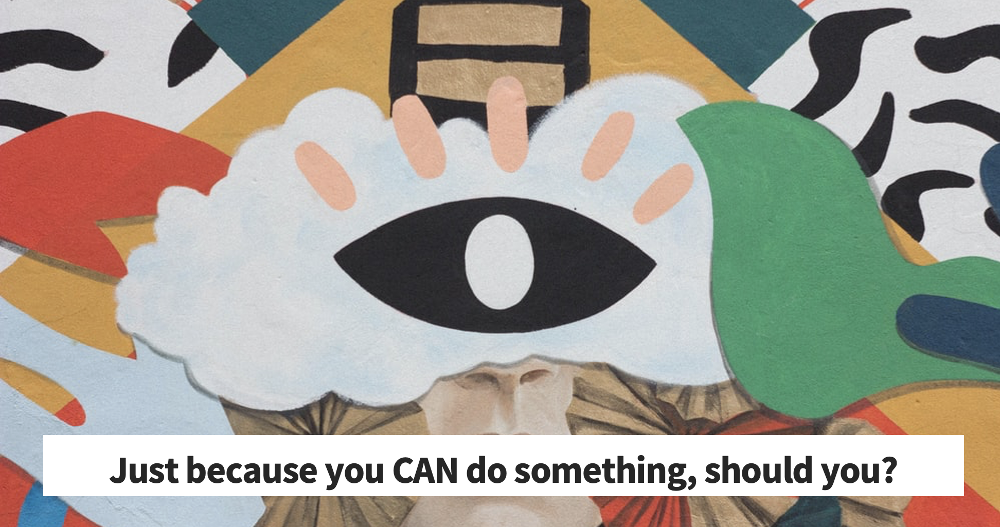
```

---
## The Ethical Scraper

I, the web scraper will live by the following principles:

.midi[
+ If you have a public API that provides the data I'm looking for, I'll use it and avoid scraping all together.
+ I will always provide a User Agent string that makes my intentions clear and provides a way for you to contact me with questions or concerns.
+ I will request data at a reasonable rate. I will strive to never be confused for a DDoS attack.
+ I will only save the data I absolutely need from your page. If all I need is OpenGraph meta-data, that's all I'll keep.
+ I will respect any content I do keep. I'll never pass it off as my own.
+ I will look for ways to return value to you. Maybe I can drive some (real) traffic to your site or credit you in an article or post.
+ I will respond in a timely fashion to your outreach and work with you towards a resolution.
+ I will scrape for the purpose of creating new value from the data, not to duplicate it.
]

.footnote[Source:  James Densmore, https://towardsdatascience.com/ethics-in-web-scraping-b96b18136f01]

---
## Terms and Conditions and Robots.txt

Many sites give instructions about what you're allowed and not allowed to do on them.
One way is through the Terms and Conditions and another is through a file called robots.txt.

.pull-left[
.midi[
#### T&Cs
Ideally, we should all be reading all the Terms and Conditions of all the websites we use…and of course I'm sure you dooooo.

But when in a hurry, search (CTRL+F or CMD+F)  “scrape”, “harvest” “crawl” and if none of those come up then “data” and “copied” more generally and that can give you a sense if they prohibit certain uses.
]]

.pull-right[
.midi[#### Robots.txt
Most large websites have a robots.txt page to give instructions about what 'robots' are and aren't allowed to visit the page. This is most often used for search engines, but we can check them too. Bad bots can still do what they want. 

More on these protocols (and templates you could add to your own site here).
http://www.robotstxt.org/robotstxt.html 
]]

---
class: middle

An ethical scraper…
+ ...follows the site's terms and conditions and/or robots.txt.
+ ...uses an API when provided.
+ ...rate limits their requests.
  + I.e., respect a 'crawl limit' suggested by the site, 5 seconds is a polite default if not told otherwise.
+ ...credits their sources.

---
## Using an API

API stands for __a__pplication __p__rogramming __i__nterface. 

It is a structured way for data (broadly) requests to be made and fulfilled with computers. 

I like [this](https://www.howtogeek.com/343877/what-is-an-api/) comparison to a restaurant menu. You don't need to know HOW to make crème brûlée to be able to know you WANT it.

--

If you are using an API, there still may be rules about things like how many requests you can make in a certain time frame and rate limiting. Make sure you're aware of these rules and behave in the spirit of them!

Optional reading (not assessed): https://beanumber.github.io/mdsr2e/ch-ethics.html#sec:terms-of-use 

---
class: middle 

## Indigenous data sovereignty

---
## Indigenous data sovereignty

Countries and nations tend to want data collected and stored about them/their people to be subject to their laws. You might see examples of this in how government agencies require any cloud storage they use to have the servers be based within their boundaries. This area of thinking is often called __data sovereignty__.

--

Canada is one of many countries with a history of colonization by settler peoples and the displacement of, discrimination against, and in many cases mass murder of the Indigenous peoples. As countries like Canada go through processes of truth and reconciliation to address these violent and oppressive histories, _indigenous data sovereignty_ has also become a growing area of thought.

---
## Indigenous data sovereignty

Why do statisticians needs to know about this? Because we must move from data gathering and analysis as further tools of oppression and be part of honouring the sovereignty of Indigenous peoples and nations over their own data. 

1. Be aware of Indigenous rights and interests in relation to data.
1. Understand protocols for consulting with Indigenous peoples about data collection, access and use.
1. Ensure data for and about Indigenous peoples we are given access to is safeguarded and protected.
1. Support quality and integrity of Indigenous data and its collection.
1. Advocate for Indigenous involvement in the governance of data repositories.
1. Support the development of Indigenous data infrastructure and security systems.


.footnote[.midi[Several of these points generalized from the Māori context in Aotearoa New Zealand. https://www.temanararaunga.maori.nz/kaupapa]]

---
## How can U of T students develop their knowledge?

.midi[
While there aren't yet specific data sovereignty trainings (we're looking at developing these resources), there are several workshops, events and trainings you have access to. 

Go to https://clnx.utoronto.ca and check out the Events & Workshops section.

+ St George Calendars: First Nations House - Indigenous Student Services 
+ Tri-Campus Calendar: Indigenous Cultural Education 

Look for workshops with __John Croutch__ and/or on the following topics:
+ Reconciliation: Walking the Path of Indigenous Allyship
+ Reflecting on Land Acknowledgements
+ Speaking Our Truths: The Journey Towards Reconciliation | 2 days P1 & P2

As well as being important knowledge for working and living in the Canadian context, as we go forwards there is going to be a competitive _disadvantage_ to being ignorant about these issues if seeking work in government, health and social agencies. Many private sector organisations are also making developing these competencies a priority in staff education. 
]

---
class: middle
## Selection bias

---
## Selection bias

Selection bias can occur in a range of ways, but the key feature is that your sample is not representative of the population. 

__Example__: Suppose I want to email out a survey to investigate if U of T students think statistics is important for their future career. I only have the emails for students I teach...in statistics courses. If I randomly sample from this list of students, can I make claims about the population of all U of T students? No.

__Example__: _The healthy migrant effect_. It has been noticed in many countries that migrants have mortality advantages over local-born populations. While there are several possible things going on and being researched in this area, these findings likely show a component of 'selection bias' in that usually only healthy people can migrate, either due to health screening requirements in the country to which they are migrating, or by people with health complications self-selecting out due to inability/disinclination.

Survivorship bias, on the next page, is a specific type of selection bias.

---

### Survivorship bias
.pull-left[.midi[
_Note: There is a risk that I'm about to ruin a bunch of 'inspirational' internet content for you._ 

If you've spent any time on LinkedIn, and probably lots of other social media sites, you've probably seen an image like this one. Is it inspiring? Sure, maybe.... BUT as an attempted claim about the value of failure it commits the logical error of focusing on just the people who eventually succeeded. I'm sure there are plenty of unemployed, divorced, university dropouts _not_ writing _Parry Hotter and the Windows OS_...
]]

.pull-right[
```{r, echo=FALSE, fig.align='center', out.width="65%"}
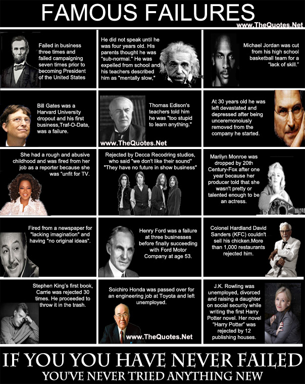
```
.tiny[ [Click for source.](https://www.thequotes.net/2013/08/failures-are-stepping-stones-to-success/)]
]


---
class: middle, center, inverse
name: analyse
# Analyzing data

.header[<u>[Go to topics list](#topics)</u>]

---
class: middle
## Analyzing data topics

In our readings for Weeks 2 and 3, the reproducibility crisis, P-hacking and HARKing have been discussed.

I won't cover P-hacking and or the reproducibilty crisis any further, as these reading are great introductions, but the next few slides talk a little more about __HARKing__ and __multiple testing problems__.

+ __Week 2__: Motulsky, H.J., (2014). Common misconceptions about data analysis and statistics. https://doi.org/10.1007/s00210-014-1037-6
+ __Week 3__: Aschwanden, C. (2015). Science Isn't Broken: It's just a hell of a lot harder than we give it credit for. Retrieved from https://fivethirtyeight.com/features/science-isnt-broken

---
## HARKing
.pull-left[
.midi[HARKing is "__H__ypothesizing __A__fter the __R__esults are __K__nown". 

I sometimes talk about this as the 'no peeking rule' in setting up hypotheses. For example, you should never pick a one-tailed hypothesis test because of your data, it should only be based on findings from previous studies or a physical theory of a phenomenon.

There was a good introduction to this idea in [last week's Motulsky paper](https://link.springer.com/article/10.1007%2Fs00210-014-1037-6) (the XKCD jelly bean comic!).
Kerr, N. L. (1998). "HARKing: Hypothesizing after the results are known". Personality and Social Psychology Review. 2 (3): 196–217. doi:10.1207/s15327957pspr0203_4
]]

.pull-right[.midi[
There are critiques about whether HARKing is as harmful to science as sometimes claimed and a lot of yummy philosophy of science that we won't go into. If you're interested in this area, try reading Rubin (2017), ["When Does HARKing Hurt? Identifying When Different Types of Undisclosed Post Hoc Hypothesizing Harm Scientific Progress"](https://journals.sagepub.com/doi/10.1037/gpr0000128) ]

```{r, echo=FALSE, fig.align='center', out.width="70%"}
include_graphics("libs/images/w3/hark.gif")
```
]


---
## Multiple testing problem

.midsmall[
One of my favourite examples of positive academic trolling is the dead salmon study. The study used methodology for exploring animal reactions to human emotions expressed in photographs through fMRI scans.

```{r, echo=FALSE, fig.align='center', out.width="60%"}
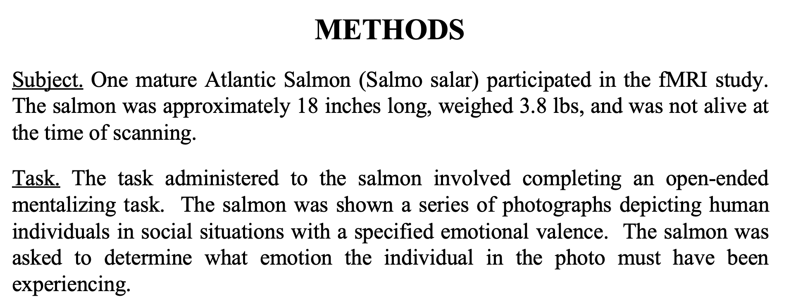
```

If the researchers had ignored the issue of multiple comparisons (there are thousands of areas for which brain activation is measured) they might have ended up with test results that claimed the (dead) salmon was engaging in 'perspective-taking' when shown the photos of the humans. (It was not).

See the poster here: http://prefrontal.org/files/posters/Bennett-Salmon-2009.pdf]

---
## Multiple testing problem (cont.)

.midi[ 
We mentioned this in passing in Week 1 when talking about ANOVA being preferable to doing t-tests between every pair of levels and it was mentioned in conjunction with HARKing in [last week's Motulsky paper](https://link.springer.com/article/10.1007%2Fs00210-014-1037-6).

___But what is actually going on here?___

Suppose you've picked a significance level of $\alpha = 0.05$. When conducting just one test this means we're accepting a 5% risk of making a Type 1 Error, that is, rejecting the null hypothesis when we shouldn't. BUT, if we are conducting several tests at the same time, then we need to think about our __family-wise error rate__, which is our chance of making at least one Type 1 Error across all our tests.

So, if you are making a Type 1 Error 5% of the time, the idea is that 95% of the time you're not. And while 95% is pretty good, if your tests are independent and you're doing $m$ of them, your  'not making an error' rate becomes $0.95^m$, e.g., if you're doing 20 tests, $0.95^{20} = 0.359$, meaning our chance of making at least one 'false discovery' is now ~64%
]

---
## Correcting for multiple comparisons?

There are multiple methods investigators employ in an effort to have their Type 1 Error across multiple tests actually reflect the error rate they are comfortable with.

The simplest but most conservative of these is the Bonferroni correction where you just divide your significance level (e.g., 0.05) by the number of tests you are conducting  and use that as the new significance cut off. 

E.g. If you'd usually use a 5% threshold and are doing 20 tests, your new threshold is $$\alpha_{adjusted} = \frac{0.05}{20} = 0.0025.$$ 
As you can see, this is now a much stronger level of evidence we're requiring against our null hypothesis than when doing a single test.


---
class: middle, center, inverse
name: decisions
# Making decisions with data

.header[<u>[Go to topics list](#topics)</u>]

---
class: middle
## Making decisions with data topics

+ Algorithmic bias
+ Should algorithms be transparent?
+ Lum & Isaac reading

---
## Algorithmic bias

.midi[Prediction models are taught what they "know" from training data. 
Training data can be incomplete, biased, or skewed. This can result in
__algorithmic bias__.]

### Proxy variables

.midsmall[There can also be situations where we know we DON'T want to use a variable as part of an algorithm, for ethical and often legal reasons (anti-discrimination laws about gender, race, health status, e.g. American's with Disabilities Act means you can't discriminate against people with mental health conditions). BUT there might be other variables in your data, like certain types of hobbies/memberships, home address, 'personality' quiz questions, that act as 'proxies' for these things, meaning they end of determining outcomes even when you don't want them to.]

.small[
__Optional reading__
+ Amazon scrapped 'sexist AI' tool, BBC, 2018. https://www.bbc.com/news/technology-45809919 
+ Amazon discreetly abandoned gender-biased AI-based recruiting tool, HRK News, 2018 https://www.hrkatha.com/recruitment/amazon-discreetly-abandoned-gender-biased-ai-based-recruiting-tool/
]

---
## Should algorithms be transparent?

Some predictive algorithms give us more than just a prediction: they also give us some
insight as to what factor(s) influenced the prediction. Examples you might have encountered in your studies already include linear regression models and classification trees.

Other algorithms yield predictions, but no information about how it got from the inputs
to the prediction, such as neural networks (you may see these in future courses). These are sometimes called 'black box' algorithms and many machine learning tools fall into this. We'll briefly talk more about this when we discuss generalized additive models later in the course. 

What is more important - getting the most accurate predictions, or understanding the factor(s) which influence a prediction?

---
class: middle 

## Required reading

Lum, K & Isaac, W. _To predict and serve?_ (2016). https://rss.onlinelibrary.wiley.com/doi/full/10.1111/j.1740-9713.2016.00960.x#sign960-bib-0001

.pull-left[
.midi[
This article is an excellent and accessible introduction to ideas around predictive policing and the current issues.  

(Lum's other work, previously as the Lead Statistician at the Human Rights Data Analysis Group and now as a prof at the University of Pennsylvania is awesome!)
]]

.pull-right[

```{r, echo=FALSE, fig.align='center', out.width="95%"}

```

.small[(If you've seen Minority Report, maybe you were already skeptical about predicting crimes before they happen...but probably for different reasons.)
]]

---
class: middle, center, inverse
name: comms
# Statistical communication

.header[<u>[Go to topics list](#topics)</u>]

---
## Prioritize statistical communication as part of your toolbox

While the technical skills of U of T statistics graduates are well received by employers. There is a common theme of communication skills not matching their business needs. 

This is part of the thinking behind the emphasis on writing in this course, your professional development task and the project, as well as providing opportunities to 'talk stats' in Team Up! groups. 

The section lays out some overarching tips about how to think about your role as a statistical communicator and some general tips about statistical reports, and their contents and structure.

---
## What can statisticians learn about communication from Winston Churchill's mother's dinner conversation?

In the lead up to a British election during the Victorian era, Jennie Jerome (Churchill's mum) attended a dinner with the leader of the Conservatives, Benjamin Disraeli, and the leader of the Liberals, William Ewart Gladstone. She said:

> "When I left the dining room after sitting next to Gladstone, I thought he was the cleverest man in England. But when I sat next to Disraeli, I left feeling that I was the cleverest woman."

--

Who won that election? Disraeli.

.footnote[.midsmall[(Optional) Read more here: https://www.businessinsider.com/charismatic-leadership-tips-from-history-2016-10]]

---
class: middle


So, what *can* statisticians learn about communication from Winston Churchill's mother's dinner conversation?

--

I think of this story often when working with clients. Especially early in my career, while I was still building my confidence, there was always the impulse to 'show off' my stats knowledge through jargon in some attempt to show that I was 'worth the money' clients were paying.

--

And sure, you need to have substance and skill to do the job well. But always think of your job when communicating with non-statisticians as additionally one of **education**. 

--

You want repeat business? Or to impress your non-statistician manager? Then communicate in ways that helps them to 'aha!' moments. **Have them leave you feeling cleverer about statistics than they thought they were coming in.**


---
Below is a screenshot from a Talk [Chelsea Parlett-Pelleriti, @ChelseaParlett](https://twitter.com/ChelseaParlett) gave at the [Toronto Data Workshop](https://rohanalexander.com/toronto_data_workshop.html) $^1$. These are the questions she asks herself when communicating about statistics and ones I think we should all ask ourselves, too. 

```{r, echo=FALSE, fig.align='center', out.width="50%"}
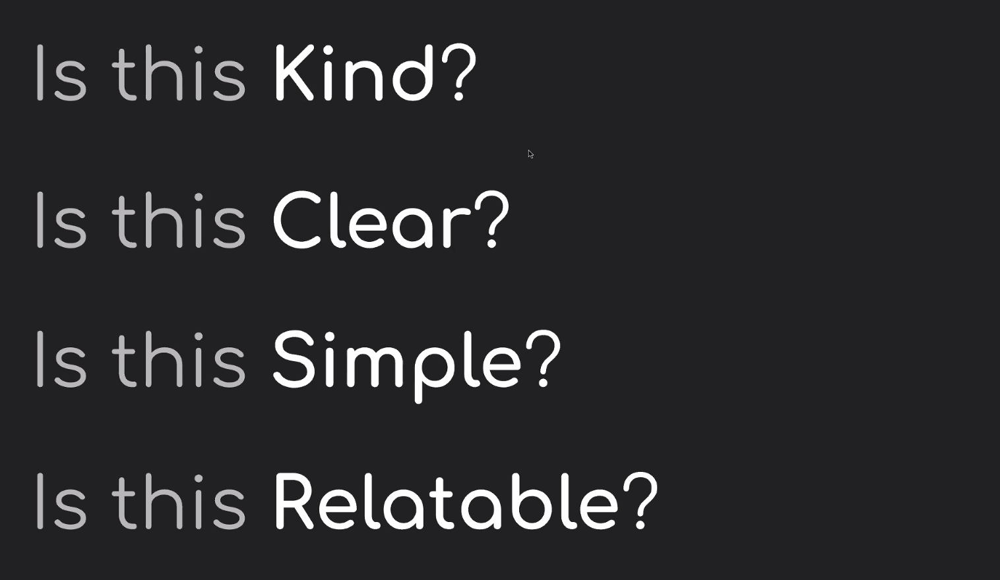
```

.footnote[1 Parlett-Pelleriti, C. (2020) *Talking to non-statisticians about statistics*. Toronto Data Workshop presentation, September 24.]

---
## What do statisticians usually *write*?

Statisticians must often write reports to summarize the results of scientific research or data analyses:

**Academia, health sciences, etc.**: Write "methods" section of collaborative papers.

**Industry**: Write reports summarizing results of data analyses / research for use within the company.

---
## Common report components: First look
.midsmall[
.pull-left[
### Abstract (or summary)

These are common academic articles.

* Short and to the point
* Self-contained (i.e., someone could read this and only this and get the gist of your work)
* Emphasize conclusions rather than specific methods
* Approximately 100–200 words
* No figures, no tables, no/few references.

#### 'Plain English' summaries 
These are also becoming popular in some academic journals. Think of this as something a high school student could read and understand the purpose of the article. [Nice suggestions + example here (optional).](https://www.agu.org/-/media/Files/Share-and-Advocate-for-Science/Toolkit---PLS.pdf)]

.pull-right[
### Executive summary
You might see this more commonly in business or government contexts. It is a summary aimed at busy and **non-technical** 'executives' (for example) and would accompany or preface a more detailed technical report. Your ability to communicate flexibly to different audiences is very important here.

* Short and to the point
* Self-contained
* Use bullet points.
* Emphasize conclusions/recommendations.
* *Might* include the most important figures and tables, very carefully chosen.
]]

---
## Common report components: Introduction

**Purpose**: provides background information about the project/research.
* Why was the investigation done?
* What research questions are considered in the report (scope)?

The final paragraph of the introduction should outline what is in the rest of the report. Think of it as the road map.

.midsmall[
#### Important:
If you are consulting for a client/collaborator, don't pretend to be an expert if you are not one! The purpose of this section is to provide context (as you understand it) for the rest of your report, so that the report is a complete document, and it is clear what you will and will not address.]

.footnote[.small[If you're interested in statistical consulting, STA490 is a great course (I'm biases), though often limited to students in the Methods and Practice Specialist.]]

---
## Common report components: Data summary (optional)

Useful if you feel you need more details than you can reasonably give in the Introduction and/or what will be discussed in a Methods section.

**Purpose**: describing the data, but not answering the research question (which you will put in the "Results" section).

**Might include:**
* Basic summary tables, graphs, and descriptive statistics.
* Changes made to the data to make it suitable for analysis.
* Discussion of decisions around missing data.
* Large tables or series of graphs should go in an *appendix*, not in the main body of the report.

---
## Common report components: Methods

.midi[
* Briefly describe the design of the scientific study, in the context of the analysis.
    - If you're writing for a collaborator, you don't need to tell the collaborator what *they* did. Use this section for what you did!
    - Resist the temptation to make a diary. This shouldn't be a digest of everything you've done (only the key analyses which you wish to comment on in the results section).
* Do .redify[NOT] include trivial information (e.g., "The data in Excel were saved in a text file and read into R“).
* Be clear which methods were used for what purpose, related to the context of the project. This will likely need to be clarified further in the results section.
* The required level of detail depends on the statistical method.
    - Basic/standard methods (e.g., t-tests, linear regression): do not need to explain.
    - More advanced methods: explain the general motivating ideas in words; you are not writing a statistics textbook!
* A separate methods section is traditional in many scientific journals, but can be difficult (and frustrating) to write if it is too disconnected from the analysis. *Sometimes* it is better to describe the methods and results together.]

---
## Common report components: Results

.pull-left[
* Make sure this section is clearly organized, point-by-point, in paragraphs.
* Computer output .redify[NEVER] goes in the body of the report, and RARELY in an appendix, though this depends on your audience/future users.
* Include graphs and small tables that tell the main story; less relevant graphs/tables should go in an appendix.
]
.pull-right[
```{r, echo=FALSE, fig.align='center', out.width="100%"}
#include_graphics(str_c(here::here(), "/images/w3/worst-graph.png"))
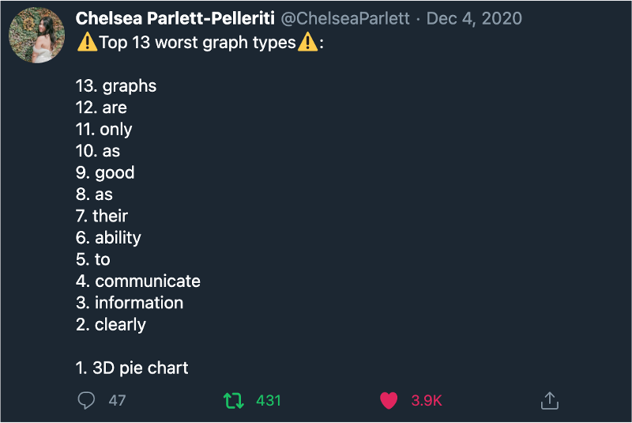
```
.tiny[Source: https://twitter.com/ChelseaParlett/status/1335009390567456768]
]

---
## Aside: Graphs that made me want to cry this week...

```{r, echo=FALSE, fig.align='center', out.width="90%"}
#include_graphics(str_c(here::here(), "/images/w3/worst-graph.png"))
include_graphics("libs/images/w3/fiscal.png")
```
.tiny[Source: https://fiscal.treasury.gov/files/reports-statements/financial-report/2019/executive-summary-2019.pdf]

---
## Common report components: Results (cont.)

.midi[
* If you include a figure/table, you must refer to it in the body of the report (NO lonely figures/tables!). Describe in words what the table/graph shows.
* If you find you are repeating all of the information that is in the graph or table, consider whether or not you need the graph or table.
The purpose of figures and tables is to illustrate a pattern, which should be clear for someone looking at it.
* Figures and tables require clear labels and captions (not too small!).
    - General advice/convention is that tables are read from top to bottom, and so **table captions go on top of the table**. Figures on the other hand are read 'bottom to top' and so **figure captions go below the figure**. If your image is not in a report (i.e. an info-graphic like our charts from the data exploration assessment) you might prefer to have a clear title (and subtitle) at the top instead of a caption.
* You may want to group similar graphs into a figure with sub-figures (e.g., Fig 1a, 1b —be sure that the labels/captions are large enough to read though)
* **Describe results in words** and include, parenthetically, the relevant statistics such as means with standard errors (or confidence intervals) or the test statistic with p-value. 
    - **Round appropriately!** What is an interesting or useful level of 'granularity' for this study?
]
---
## Common report components: Conclusion/discussion

* __Summarize__ what was learned regarding the research question.
* Discuss possible __weaknesses/limitations__ in the study and/or analysis and specific suggestions for future considerations.
* If appropriate (often done in academic articles) discuss __strengths__/positive points of difference of this study also.
* Explain what the work was able to achieve and not able to achieve.

## Common report components: References

* Only include references that have been cited in the text.

---
## Common report components: Appendices

* Include tables and figures which would __interrupt the flow__ of the report if they were included in the main body (e.g., less relevant, but still interesting)
* Keep in mind this is __*not* a dumping ground__. Only include graphs/tables which would be useful/interesting to your audience, and make sure any figures/tables you include there stand alone (e.g., with detailed titles and captions) and are supported by text if necessary.
* If you include an appendix, you should __point to it in the body of the text__, so that the reader knows when it is relevant to flip to it, if they want more information.

---
## Common report components: Final notes on organization

* The overall structure of most articles and reports? 
    - *Say what you're going to do and why,*
    - *do it,* 
    - *say what you did (and what it means).*
* The **ordering** of ideas should be consistent throughout your report.
E.g., if there are multiple research questions in the introduction, they should be addressed in the same order in the methods, results, and conclusion. This is such a simple thing, but easy to forget in the moment.
* You *could* also combine the methods/results sections and **organize your report by the question being answered** (with one subsection for each question).
    - In each subsection, state the methods used and the results.
Having separate sections for methods and results makes more sense if the same methods are used repeatedly.
* Many people only read the introduction and conclusion (or at least they start there...) so make these sections are complete and self-contained.


---
class: middle, center, inverse
name: reading
# Reading strategy: Previewing and skimming

.header[<u>[Go to topics list](#topics)</u>]

---
## Reading strategy: previewing and skimming

*This section provides some context for your [weekly writing task](https://q.utoronto.ca/courses/204826/assignments/506341) this week.*

.midsmall[In graduate school and/or in future employment, it is likely that you will need gather and synthesize information from a range of written sources. To decide if a source is useful to you, and to be as efficient and effective as possible, it is important to have strategies for approaching reading. For this week's weekly writing task, you are being asked to respond to an article called *Science isn't broken*. You'll notice that it further discusses some of the ideas you were introduced to in last week's reading, as well. 

Work through the *previewing* and *skimming* instructions in the prompt.

_**Previewing**_ a written text helps you think about the origins and purpose of the text, how it is organised, and where you expect to find information.

_**Skimming**_ is done after previewing, and is a strategy of reading key paragraphs, like the first and last which usually introduce and conclude the piece, as well as reading the opening sentences of in-between paragraphs and paying attention to figures, captions and any other emphasized text.]


.footnote[.small[Aschwanden, C. *Science isn't broken*. (2015). Retrieved from https://fivethirtyeight.com/features/science-isnt-broken/#part1]]

---
class: inverse, middle

# See you Wednesday for class!

.header[<u>[Go to topics list](#topics)</u>]

```{r eval = FALSE, echo = FALSE}

pagedown::chrome_print("sta303_w3_slides.html", wait = 20)

```

