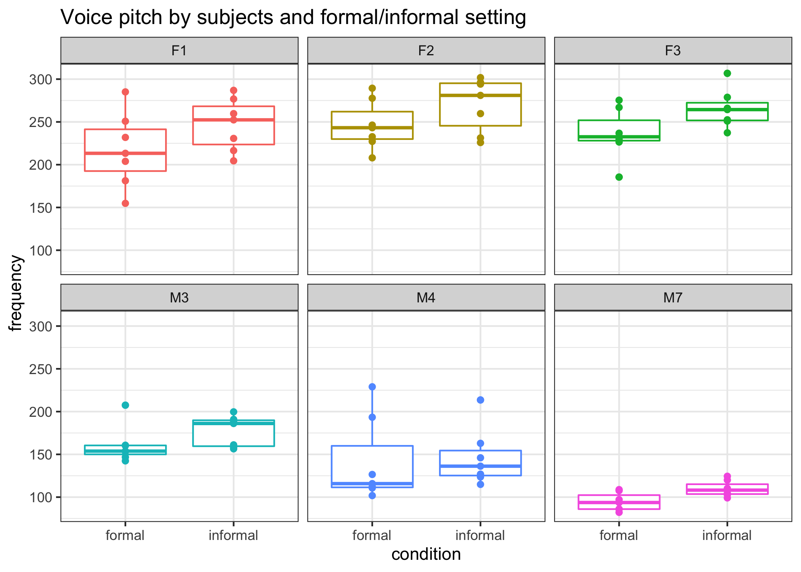
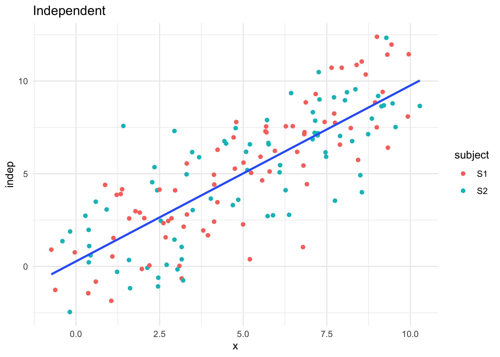
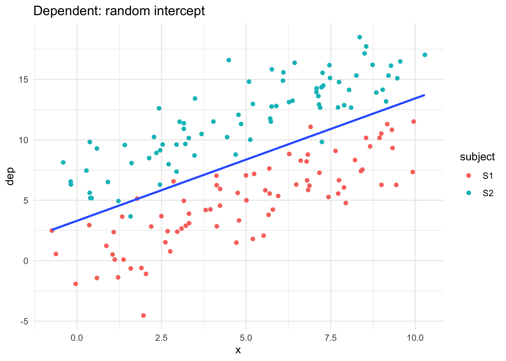
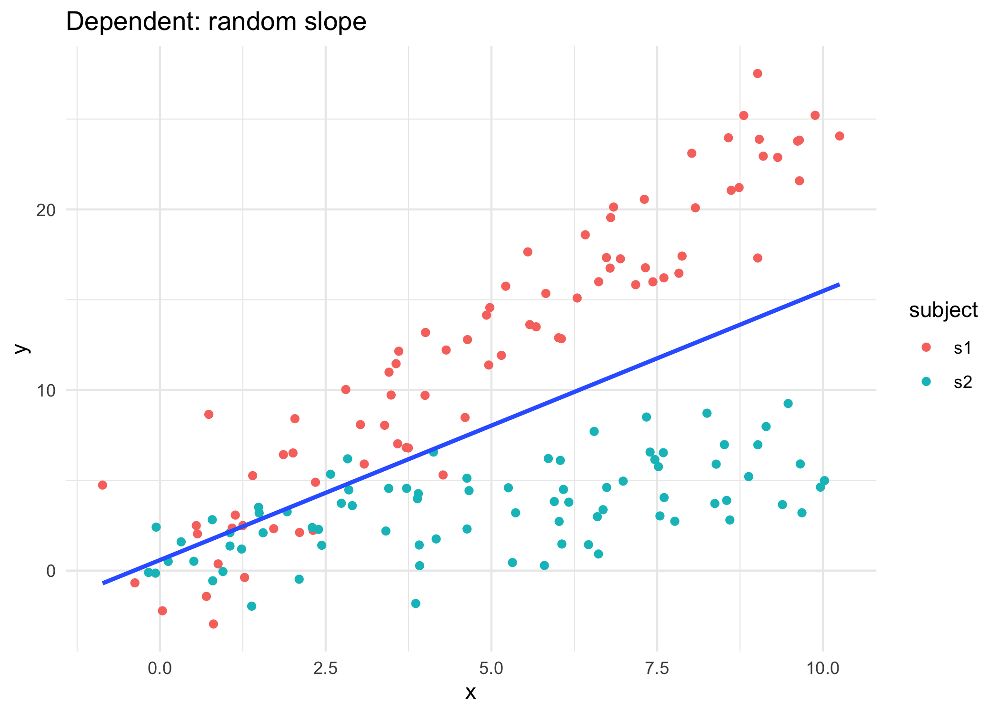
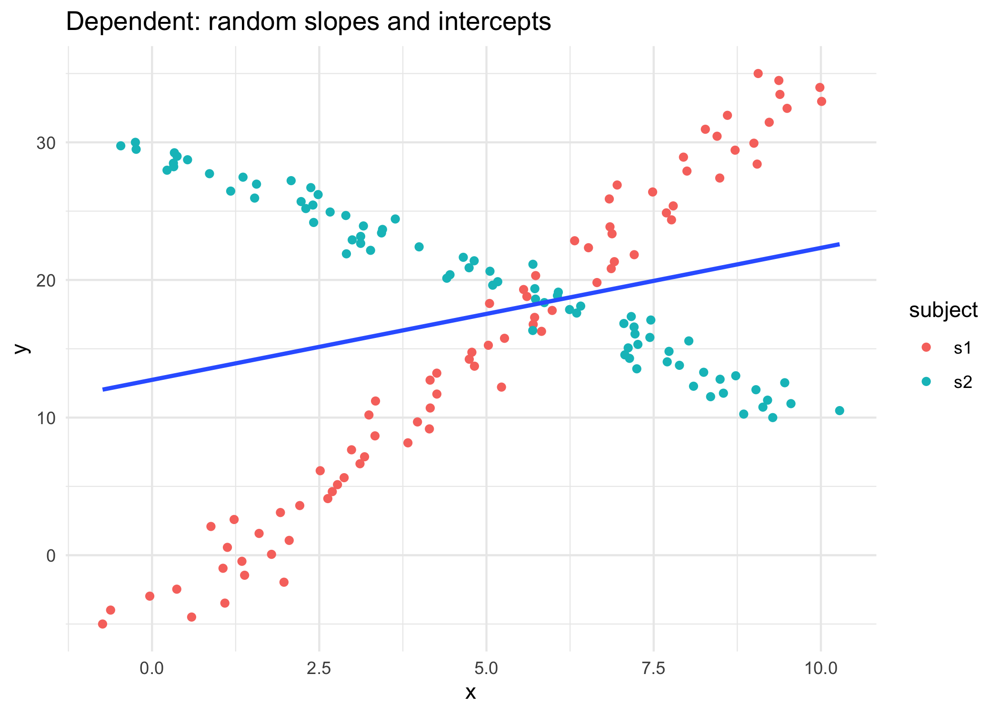
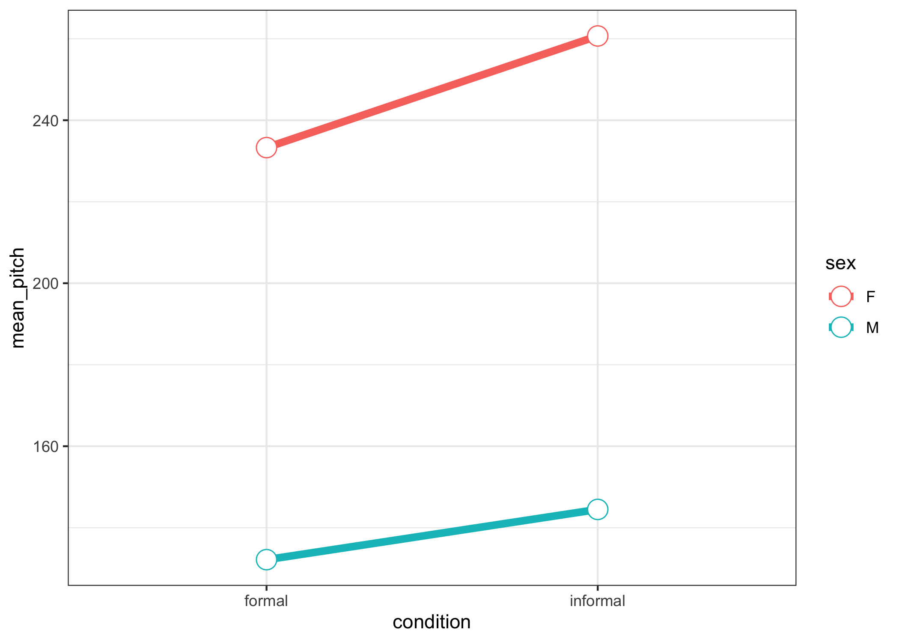
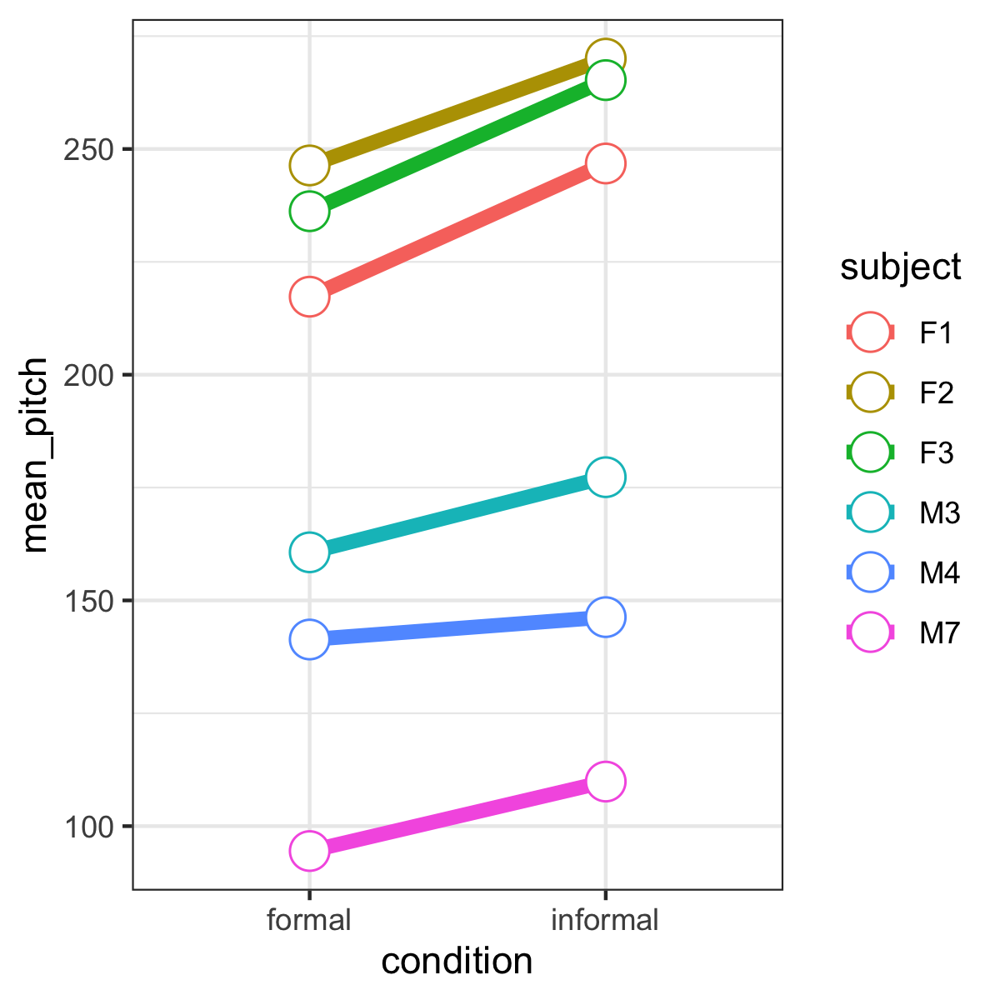
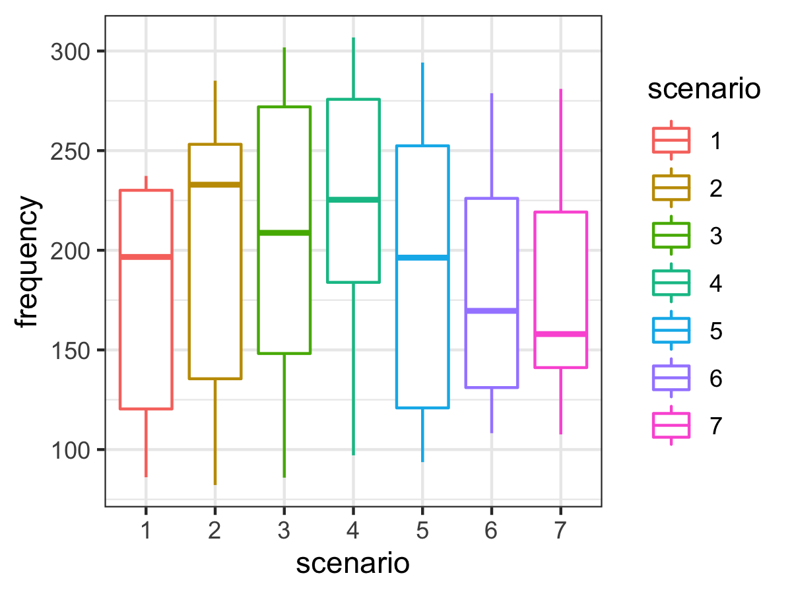
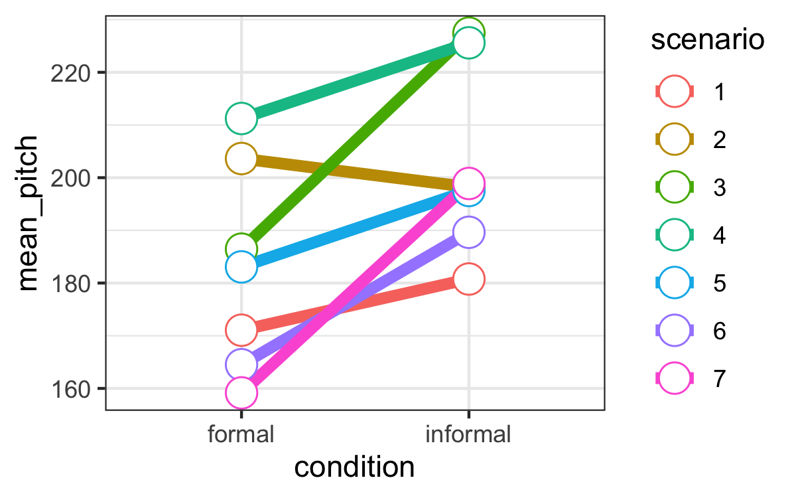

```{r setup, include=FALSE}
# R options
options(
  htmltools.dir.version = FALSE, # for blogdown
  show.signif.stars = FALSE,     # for regression output
  warm = 1,
  crayon.enabled = FALSE
  )
# Set dpi and height for images
library(knitr)
opts_chunk$set(fig.height = 2.65, dpi =300, warning=FALSE, message=FALSE) 
# ggplot2 color palette with gray
color_palette <- list(gray = "#999999", 
                      salmon = "#E69F00", 
                      lightblue = "#56B4E9", 
                      green = "#009E73", 
                      yellow = "#F0E442", 
                      darkblue = "#0072B2", 
                      red = "#D55E00", 
                      purple = "#CC79A7")

library(tidyverse)
library(gridExtra)
htmltools::tagList(rmarkdown::html_dependency_font_awesome())
### xaringan::inf_mr() -> use this for display within Rstudio

xaringanExtra::use_share_again()
xaringanExtra::style_share_again(
  share_buttons = "none"
)

htmltools::tagList(
  xaringanExtra::use_clipboard(
    button_text = "<i class=\"fa fa-clipboard\"></i>",
    success_text = "<i class=\"fa fa-check\" style=\"color: #90BE6D\"></i>",
    error_text = "<i class=\"fa fa-times-circle\" style=\"color: #F94144\"></i>"
  ),
  rmarkdown::html_dependency_font_awesome()
)
```

name: topics

## Topics
You can click the following links to navigate through the slides (in the HTML version).

* [Follow-ups from the check-in survey](#admin)
* [Vocal pitch case study: part 1](#part1)
* [Linear mixed models in R](#theory)
* [Additional considerations](#add)
* [Vocal pitch case study: part 2](#part2)
* [Interactions between random effects and fixed effects](#interaction)
* [More fixed vs random effects practice](#fr)

---
class: middle, center, inverse
name: admin
# Follow-ups from the check-in survey

.header[<u>[Go to topics list](#topics)</u>]

---
## Thank you for completing the end-of-week check-in!

* Definitely still some questions/uncertainties around setting up the linear mixed models, and fixed/random effects, hopefully these will all be more clear after this module.
* Student suggestion: Put the __latest module__ on the top so you don't have to scroll to get to the new content. Great idea! I've switched the order now so the newest modules are at the top.
* Feedback: It is harder for some of you to take notes when theory is introduced in the __interactives.__ This was mentioned by your student reps at the meeting, too! Thanks for letting me know, I'll aim to introduce new concepts in slides (easier to annotate) and then provide practice in interactives, as appropriate.

---

## End-of-week check-in comments (cont.)

* __JupyterHub activities__: If you have been having trouble with the interactives, make sure you're familiar with how to run them from the files pane of RStudio. See the [Week 4 class recording](https://q.utoronto.ca/courses/204826/pages/course-overview) for a demonstration of how to do this. My working theory is that this is happening for folks using VPNs and/or with slow internet and is effectively a timeout error. Make sure you also know how to delete the folder. See the [Course tools slide show](https://q.utoronto.ca/courses/204826/pages/course-tools#jupyter) and then use the access link to get it back as that is another way to troubleshoot.

  
.footnote[Didn't do the check-in? Look out for future ones in the Friday end-of-week wrap-up 🎁.]

---
## End-of-week check-in comments (cont.)

* __Data exploration__ assessment: If you're having trouble matching the neighbourhoods in Task 3, data wrangling part 2, make sure you check out the week 2 case study, specifically how we dealt with the email typos. This is real data with _real_ mistakes by the creators that we have to deal with. Hint: While there are multiple ways you could approach fixing the data so you can merge appropriately, in my version of the code I've used `str_remove()` twice _after_ creating the `neighbourhood_name` variable.
  * There have been some great discussions on [Piazza](piazza.com/utoronto.ca/winter2021/sta303h11002hs/home), you may find hints for anything you're struggling with there already.
* __Extensions/accommodations__: If you miss an assessment due to unforeseen illness/personal emergency, please complete the associated form (see the info table at the top of each assessment). If you wish to request an extension _ahead of time_, e.g. if you know you'll be in a quarantine situation with poor internet connection or for accessibility reasons (make sure I have a copy of your accessibility letter), please email sta303@utoronto.ca at least 2 business days before the due date (page 9 of the syllabus for more). 

---
## Upcoming assessments  
### Weekly

* [Week 4 writing Reflect phase](https://q.utoronto.ca/courses/204826/assignments/506341) (due Feb 08 at 6:00 p.m. ET)
* [Week 5 quiz]() (due Wednesday, Feb 10 at 10:00 a.m. ET)
* [Week 5 writing](https://q.utoronto.ca/courses/204826/assignments/506343)
    - Create phase due Feb 11 at 6:00 p.m. ET
    - Assess phase due Feb 12 at 6:00 p.m. ET
    - Reflect phase due Feb 16 at 6:00 p.m. ET (due one day later than usual due to Family Day)

---
## Upcoming assessments  
### [Data exploration assessment](https://q.utoronto.ca/courses/204826/assignments/415115) (due Friday, Feb 16 at 6:00 p.m. ET)
  * Because Feb 12 is Lunar New Year I am granting _everyone_ a no penalty extension to Tuesday, Feb 16 at 6:00 p.m. ET. This is the Tuesday of reading week, after Family Day. Please note that there are __no office hours__ during reading week. Make sure you have started well in advance of the due date as there are 'quirks' to these datasets and Piazza will not be monitored of the weekend.
    * The last TA office hours before the due date will be Friday, February 12 and Piazza will __not__ be monitored over the weekend/holiday, so make sure you're planning accordingly.

---
## Upcoming assessments  
### Mixed assessment 1 after reading week

* This assessment is 'mixed' because you will be given a guided analysis to work through __untimed and asynchronously__ and then sit a 50-minute __timed assessment__ that must be completed in the __24-hour assessment window__ from 4:30 p.m. ET Tuesday, Feb 23 to 4:30 p.m. ET Wednesday, Feb 24. MARK YOUR CALENDAR NOW! It is the week after reading week. 

---
class: middle, center, inverse
name: part1
# Vocal pitch case study: part 1

.header[<u>[Go to topics list](#topics)</u>]

---
## Motivation

.midi[You're interested in a language and especially want to investigate how **voice pitch** (perceived “highness” or “lowness” of a voice) is related to politeness for speakers of that language.

#### Design of the experiment
* You recruit 6 speakers of the language as subjects in your study. 
* There are 3 males and 3 females.
* Each subject is asked to respond to 14 hypothetical situations. 
    - 7 of these situations are *formal* situations that usually require politeness (e.g., giving an excuse for being late to your scary boss), and 
    - 7 were more *informal* situations (e.g., explaining to a friend why you’re late). 
* For each hypothetical situation you measure the subjects voice pitch as they respond. You also take note of each of your subjects’ sex, since you know that’s another important influence on voice pitch.]

.footnote[.small[Much of the content here is adapted from Winter, B. (2013). **Linear models and linear mixed effects models in R with linguistic applications**. arXiv:1308.5499. The language considered was Korean.]]

---
## Formal vs informal example

.pull-left[
#### Talking to your boss

```{r, echo=FALSE, fig.align='center', out.width="50%"}

```
]
.pull-right[
#### Talking to your friend
```{r, echo=FALSE, fig.align='center', out.width="50%"}

```
]

.footnote[.small[Photos from unsplash.com]]

---
## The Data
### Read in the data
.midi[For convenience, I have created a new variable called `condition`, it is just a modification of the `attitude` variable, that takes the level `formal` if the particular measurement was under formal conditions and `informal` if the measurement was under informal conditions. This variable contains the same information as the `attitude` variable, just coded how I want it to be, so I remove the `attitude` variable at the end. 

Additionally, the gender variable here is probably more accurately considered as a measure of sex here than gender identity, so I am creating a new variables called `sex` and also making it a factor.]

```{r}
# my data wrangling
polite_data = read_csv('data/w5/politeness_data.csv') %>% 
  mutate(condition = as_factor(if_else(attitude == "pol", "formal", "informal"))) %>% 
  mutate(sex = as_factor(gender)) %>% 
  select(-attitude, -gender)
```

---
### Take a look at our data

```{r glimpse, echo=TRUE}
glimpse(polite_data, width=85)
```

.pull-left[
.small[

```{r head, echo = TRUE}
head(polite_data)
```

]
]

.pull-right[
.question[Without doing any analysis, how might this data violate our assumptions for a linear model?]
]

---
## Recall: Linear regression assumptions

.large[
1. **Errors are independent (observations are independent)**
2. Errors are identically distributed and the expected value of the errors is zero, $E[\epsilon_i]=0$
3. Constant variance (homoscedasticity), $var[\epsilon_i] = \sigma^2$.
4. A straight-line relationship exists between the errors $\epsilon_i$ and responses $y_i$
]

1.-3. are usually expressed as assuming the errors are i.i.d normally distributed with mean of zero and variance $\sigma^2$, 
$$\epsilon_i \sim N(0, \sigma^2)$$

---
## Why we can't assume independence
.midi[
Each subject has 14 measurements of their pitch (measured as the frequency of the vibration of your vocal cords) in different scenarios and different levels of politeness (formal/informal).

With this kind of data, since each subject gave multiple responses (a "repeated measures" design), we can see that this would violate the independence assumption that’s important in linear modelling: **multiple responses from the same subject cannot be regarded as independent from each other**. 

In this scenario, every person has a *slightly different* voice pitch. This personal factor affects all responses from the same subject, thus responses are inter-dependent (correlated) within subjects rather than independent. I.e., if you have a generally low voice, even if you change your pitch when you are being informal versus formal, you probably still have a generally low pitch.

There also differences, on _average_ in pitch by sex, so this is something we will also want to account for in our model, later.
]

---
class: middle

# So what do we do?

---

## Let's start with a picture

Female subjects have an ID starting with "F" and males subjects have an ID starting with "M".
.question[What do you see?]

.pull-left[

```{r plot1, eval=FALSE, echo=TRUE}
polite_data %>% 
  ggplot(aes(x = condition, 
             y = frequency,
             color=subject)) +
  geom_boxplot() + 
  geom_point() +
  facet_wrap(~subject, nrow = 2) +
  ggtitle(label="Voice pitch by subjects and formal/informal setting") +
  theme_bw() +
  theme(legend.position = "none") # remove legend because we have facet names
```
]

.pull-right[ 

```{r, out.width="100%", echo=FALSE}

```

]

---
## Key themes from our plot
.midi[
1. Males tend to have lower voices than females. 
2. Within the male and the female groups, there is plenty of individual variation. Some subjects have relatively high pitch for their sex and others have relatively low values, regardless of the formal/informal version of the scenario.
3. Subjects seem to generally use a higher pitch when speaking informally than they do when speaking formally.
] 

## Before we can go further with this case study, let's establish a few things...

---
class: middle, center, inverse
name: theory
# Linear mixed models

.header[<u>[Go to topics list](#topics)</u>]

---

## Thoughts on plots for hierarchical/correlated data generally
.pull-left[
.midi[
* Make use of faceted plots! You may have also seen these called lattice plots or trellis plots. These plots show you relationships in your data, conditioned on one or more of your other variables. Facet based on your grouping units.
* When working with ggplot you can facet by adding the `facet_wrap` command. You can control which variables you condition on and how many rows and columns the facets are organised into. (There are lots of other great features we won't go in to in depth here.) 

E.g. `plot +  facet_wrap(~one_var)` or 
`plot +  facet_wrap(~one_var + two var, nrow = 3)`
]
.small[Assume `plot` is a ggplot object.]

]
.pull-right[
```{r, echo=FALSE, fig.align='center', out.width="100%"}

```

.small[These names come from the appearance of these plots being similar to the lattice of a garden trellis. They also show you different _faces_ (facets) of your data.]
]

---

## Assumptions

Linear mixed models assume that:

1. There is a continuous response variable.
2. We have modelled the dependency structure correctly (i.e. made correct choices about our random variables).
3. Our units/subjects are independent, even through observations within each subject are taken not to to be.
3. Both the random effects and within-unit residual errors follow normal distributions.
4. The random effects errors and within-unit residual errors have constant variance .

While it is possible to some extent to check these assumptions through various diagnostics, a natural concern is that if one or more assumptions do not hold, our inferences may be invalid. Fortunately it turns out that linear mixed models are robust to violations of some of their assumptions.

---

## Our model set up

.pull-left[
### Our STA302 linear model
$$\boldsymbol{y} = \boldsymbol{X\beta} + \boldsymbol{\epsilon}$$
$$\boldsymbol{\epsilon} \sim N(0, \Lambda_\theta)$$
]

.pull-right[
### Linear mixed model

$$\boldsymbol{y} = \boldsymbol{X\beta} + \boldsymbol{Zb} + \epsilon$$
$$\boldsymbol{b} \sim N(0, \psi_\theta),\ \  \boldsymbol{\epsilon} \sim N(0, \Lambda_\theta)$$]

- $\boldsymbol{y}$ is vector of outcomes for subject $i$,
- $\boldsymbol{X}$ and $\boldsymbol{Z}$ are model matrices for the **fixed** and **random** effects, respectively, 
- the vector $\boldsymbol{\beta}$ describes the effect of covariates on the mean/expectation of the outcome, $b$ is the random effects for the units (assumed to be normally distributed with mean zero), 
- $\epsilon$ is the residual errors, normally distributed with a given variance and the errors within units are mutually independent. In this course we won't deal with more complicated situations than a simple error vector that is distributed $N(0, \sigma^2)$ . 

---
## Alternative formulations
.midi[
Where you have observations $Y_{ij}$ for repeated measures $j$ on individuals $i$, you may also see:

$$Y_{ij} = \boldsymbol{X_{ij}\beta} + \epsilon_{ij}$$

Where  $\epsilon_{ij} = U_i + Z_{ij}$ and $Z_{ij} \sim N(0, \tau^2)$.

These errors are normally distributed BUT correlated.
]

### OR 

.pull-left[ 
$$Y_{ij}|U_i \sim N(\mu_{ij}, \tau^2)$$
$$\mu_{ij{ = \boldsymbol{X_{ij}\beta}+U_i}}$$
$$ [U_1,\ldots,U_M]^T \sim MVN(\boldsymbol0, \Sigma)$$
]

.pull-right[ .midsmall[
- fixed effects: $\boldsymbol{X_{ij}\beta}$ (what you're used to)
- random effects: $U_i$ for i in 1 to M (new part that makes this a linear mixed model)
]]

---
## What can correlated errors look like?

### Random intercepts

.midi[This is one example of dependence. Here, if a subject is above average in one observation, they're likely to be above average in their other observations.]

```{r randint, include=FALSE, fig.align="center"}
set.seed(92)

rand_int <- tibble(subject = rep(c("S1", "S2"), times = 80), x = seq(0, 10, length.out = 160)+rnorm(160, 0 , 0.5), dep = x + rnorm(160, 0, 2) + 7*(subject=="S2"), indep = x + rnorm(160, 0, 2))

indep <- rand_int %>% 
  ggplot(aes(x = x, y = indep)) +
  geom_point(aes(color = subject)) +
  ggtitle("Independent") +
  geom_smooth(method = "lm", se=FALSE) +
  theme_minimal()

dep <- rand_int %>% 
  ggplot(aes(x = x, y = dep)) +
  geom_point(aes(color = subject)) +
  ggtitle("Dependent: random intercept") +
  geom_smooth(method = "lm", se=FALSE) +
  theme_minimal()

# grid.arrange(indep, dep, nrow=1)
ggsave("libs/images/w5/randomintindep.png", indep, height = 5, width = 7)
ggsave("libs/images/w5/randomintdep.png", dep,  height = 5, width = 7)
```

.pull-left[]

.pull-right[]

---
### Random slopes

```{r include=FALSE}
set.seed(92)
rand_slope <- tibble(x = seq(0, 10, length.out = 80), 
                     s1 = 2.5*x + rnorm(80, 0, 2),
                     s2 = 0.75*x + rnorm(80, 0, 2)) %>% 
  pivot_longer(c(s1, s2), "subject", values_to = "y") %>% 
  mutate(x = x + rnorm(160, 0 , 0.5))
                     
 rand_slope %>% 
  ggplot(aes(x = x, y = y)) +
  geom_point(aes(color = subject)) +
  ggtitle("Dependent: random slope") +
  geom_smooth(method = "lm", se=FALSE) +
  theme_minimal()
 
ggsave("libs/images/w5/rand_slope.png", height = 5, width = 7)
```

```{r, echo=FALSE, fig.align='center', out.width="45%"}

```

In this case, not only would the residuals for subject 1 tend to be positive while the residuals for subject 2 would tend to be negative, the difference would get bigger as x increases. You don't want that kind of pattern in the residuals!

---

### Random slopes and intercepts

```{r include=FALSE}
set.seed(92)
rand_s_i <- tibble(x = seq(0, 10, length.out =80), 
                     s1 = 4*x-5,
                     s2 = -2*x+30) %>% 
  pivot_longer(c(s1, s2), "subject", values_to = "y") %>% 
  mutate(x = x + rnorm(160, 0 , 0.5))
                     
 rand_s_i %>% 
  ggplot(aes(x = x, y = y)) +
  geom_point(aes(color=subject)) +
  ggtitle("Dependent: random slopes and intercepts")  +
  geom_smooth(method = "lm", se=FALSE) +
   theme_minimal()

 ggsave("libs/images/w5/rand_slope_int.png", width =  7, height = 5)

```

```{r, echo=FALSE, fig.align='center', out.width="45%"}

```

```{r eval=FALSE, echo = FALSE}

serial_corr <- tibble(x = seq(0, 10, length.out =400), 
                     s1 = sin(x*pi*0.5) + 2 + x,
                     s2 = cos(x*pi) + x) %>% 
  pivot_longer(c(s1, s2), "subject", values_to = "y") %>% 
  mutate(x = x + rnorm(800, 0 , 0.5))
                     
 serial_corr %>% 
  ggplot(aes(x = x, y = y)) +
  geom_point(aes(color=subject)) +
  ggtitle("Dependent: serial correlation")  +
  geom_smooth(method = "lm", se=FALSE)


```

Subjects appear to have different slopes AND intercepts.

---

## How do we tell R which situation we're in?
We'll be using the `lmer()` function from the `lme4` package.

Many R packages provide a "vignette" to help you understand how to use the package and the theory behind it.

.pull-left[
```{r echo=TRUE, eval=FALSE}
# This line only installs lme4 if you haven't got it installed already
if(!("lme4" %in% installed.packages())) install.packages("lme4")

install.packages("lme4")
vignette("lmer")
```
]

.pull.right[
.question[.midi[Have you ever looked at a package vignette before?]]
]

---

### An activity for you

Use the vignette for this package to try to fill out the syntax for the following situations. You may find Table 2 on page 7 of the vignette quite helpful.

.center[]

---
class: middle, center, inverse
name: add
# Additional considerations

.header[<u>[Go to topics list](#topics)</u>]

---
## Linear mixed models come with lots of different names


---
## Additional considerations 1
### Fixed vs. random effects

Fixed effects are the things you care about and want to estimate. You likely chose the factor levels for a specific reason or measured the variable because you are interested in the relationship it has to your response variable.
Random effects can be variables that were opportunistically measured whose variation needs to be accounted for but that you are not necessarily interested in (e.g. spatial block in a large experiment). The levels of the random effect are likely a random subset of all possible levels (although as a rule of thumb, there should usually be at least 5). However, if the experimental design includes nesting or non-independence of any kind, this needs to be accounted for to avoid pseudoreplication.

---
## Additional considerations 2
### REML or ML

The math behind maximum likelihood (ML) and restricted maximum likelihood (REML) is beyond what I will assess you on in this course. The main difference between the two is how they estimate the variance parameters. They will estimate $\beta$s the same way.

REML is effectively a two-stage approach where estimates of the random effects are conditioned on the fixed effects. REML accounts for the degrees of freedom lost when estimating the fixed effects and provides us with unbiased estimates of our variance components. ML estimates of the variance components tend to be biased downward (smaller than they should be), making us more likely to pick models with simpler random effects structures than we should. 

---
## Additional considerations 2 (cont.)
### REML or ML

We __prefer ML__ if we need to compare two nested based on their fixed effects, as we can't do likelihood ratio tests with models fit with REML _unless_ the fixed effects are exactly the same. We __prefer REML__ when there is a large number of parameters or if our main goal is estimates of our model parameters (random and fixed). Which is usually our goal.

For this course, we'll usually use REML, unless we are trying to compare nested models with the same random effects. There are often not major differences between the two methods, anyways.

---
## Additional considerations 3
### Confidence intervals and tests

You can create Wald confidence intervals for fixed effects the way you're used to from STA302. BUT for our random effects things can get a bit more awkward. 

A variance must be in $[0, \infty)$, so what happens if you get an estimate for $\hat{\sigma_b^2}$ that is $0.02 \pm 0.04 = (-0.02, 0.06)$? We can get into trouble if our variance components are close to the boundary of the parameter space or if a test requires us to fix them at these boundaries.

Despite these difficulties, if our interval estimates of our variance components are pretty safely away from 0, then we can conclude the associated random effect is needed in the model. If it seems that a variance component is effectively 0, than we can conclude we don't need the associated random effect. We can also get this from likelihood ratio tests, where big or small p-values lead to clear-cut conclusions, but we face more challenges for making inferences when our p-value is close to our decision criteria.

---
class: middle, center, inverse
name: part2
# Vocal pitch case study: part 2

.header[<u>[Go to topics list](#topics)</u>]

---

## Back to vocal pitch

$$Y_{ij} = \boldsymbol{X_{ij}\beta} + Z_{i}\boldsymbol{b} + \epsilon_{ij}$$

- $Y_{ij}$ is the vocal pitch for the $i$th subject on the $j$th vocal response.
- $X_{ij}\beta$ has an intercept and an effect for sex and condition (formal/informal)
- $Z_ib$ represents subject $i$'s 'baseline' pitch
- $\epsilon_{ij}$ is random noise (and potentially other unmeasured confounders)

---

## Modelling individual means with random intercepts

We can consider each subject's mean vocal pitch and in our model we will assume different random intercepts for each subject. The mixed model estimates these intercepts for us.

We are going to use the package `lme4` and the function `lmer()` and then fit a model with only the random effect of subject (each subject gets their own intercept).

### Random intercept only model (code, output on next page)

```{r echo=TRUE}
# install.packages("lme4")
library(lme4) # load the package

sub_only = lmer(frequency ~ (1 | subject),  data = polite_data)
```

---
### Random intercept only model (output)
.midi[
```{r, echo=TRUE}
summary(sub_only)
```
]

---
## What does this model do?

`(1 | subject)` is the R syntax for a random intercept. It asks that we assume there is a different intercept for each subject. The '1' stands for the intercept and the term to the right of the '|' should be a nominal or factor variable to be used for the random effect. You can think of this formula as telling your model that it should expect that there’s going to be multiple responses per subject, and these responses will depend on each subject’s baseline level. This effectively resolves the non-independence that stems from having multiple responses by the same subject.

---
### Interpreting this output

From top to bottom:
- The model was fit using restricted maximum likelihood (REML) - what is that? We'll see soon.
- Then we are shown our formula again.
- The next part gives us the estimated variance for the random effects in the model.
- Finally, we have the fixed effect portions of the model, with a separate intercept but nothing else yet because we haven't added any fixed effects.

---

### Adding our fixed effects

We're interested in the effects of a formal/informal scenario and sex on the pitch of the subject's voice, so we'll add these as fixed effects.

.center[**Question of interest: What is the influence of formal vs informal condition on voice pitch in speakers of this language, while accounting for sex and variation within subjects?**]

---
## Model with condition and sex

.small[
```{r}
w_fixed = lmer(frequency ~ condition + sex + (1|subject), data=polite_data)
summary(w_fixed)
```
]

---

.question[You should be able to interpret the fixed effects in the way you are used to from linear models. Interpret the fixed effects coefficients below.]

```{r}
fixef(w_fixed)
```


Males have lower pitches than females by an average of 109 Hz and in informal situations speakers have a higher pitch by about 20 Hz on average.


---
## Aside: Summary of means

```{r, echo=FALSE, out.width = 1000, eval=FALSE}
polite_data %>% 
  group_by(sex, condition) %>%
  summarise(mean_pitch = mean(frequency)) %>% 
  ggplot(aes(x=condition, y=mean_pitch, 
              colour=sex, group=sex)) +
    geom_line(size=2) + geom_point(size=5, shape=21, fill="white") +
  theme_bw()

ggsave("libs/images/w5/aside.png", width = 8, height = 4)
```

.pull-left[
```{r, echo=FALSE, out.width="910%"}
#ggsave("libs/images/wk5/aside.png", width = 7, wight = 5)
 
```

]

.pull-right[This gives us a general idea of what is going on...but doesn't account for variability at all! Maybe these differences don't actually mean anything in the context of the variability of our data. That is why we want to take a modelling approach.]

---
### Random slopes for condition

.pull-left[

.midi[Previously we assumed that the effect of formal/informal conditions were the same for all subjects (one coefficient for this variable). However, the effect of the condition might be *different for different subjects*; that is, there might be a condition and subject interaction. For example, it might be expected that some people are more polite in formal scenarios, others less. We need a random slope model, where subjects and items are not only allowed to have differing intercepts, but where they are also allowed to have different slopes for the effect of formality on pitch.]
]

.pull-right[
```{r include=FALSE}
polite_data %>% 
  group_by(subject, condition) %>%
  summarise(mean_pitch = mean(frequency)) %>% 
  ggplot(aes(x=condition, y=mean_pitch, 
              colour=subject, group=subject)) +
    geom_line(size=2) + geom_point(size=5, shape=21, fill="white") +
  theme_bw()

ggsave("libs/images/w5/subject_slopes.png", width = 4, height = 4)
```



.question[Do you think the slopes are different for different subjects?]

]

---

### Random slopes for condition 
.small[
```{r}
w_slopes = lmer(frequency ~ condition + sex + (1 + condition | subject),  data = polite_data)
summary(w_slopes)
```
]

---
### Random slopes for condition

These new condition slopes are looking pretty similar...
```{r}
coef(w_slopes)
```

---

Let's compare some models. `lmtest::lrtest` will run a likelihood ratio test for us.

.question[What is your conclusion? Do we need the random slopes?]

.midi[
```{r}
lmtest::lrtest(w_fixed, w_slopes)
```

Note: We can happily do a likelihood ratio test because we have the same fixed effects and are only comparing nested random effects here. See the additional considerations section for why I mention this.


Conclusion from this test: The slopes are an unnecessary complication to our model. (I.e., No evidence against the hypothesis that the simpler model explains the data just as well.) 
]

---

.pull-left[

### Scenario random intercepts

.question[Does adding random intercepts for the scenarios improve the model?]

```{r, echo=FALSE}
polite_data$scenario = as.factor(polite_data$scenario)
scen_int <- ggplot(polite_data, aes(x=scenario, y=frequency, 
              colour=scenario)) +
    geom_boxplot() +
  theme_bw()

ggsave("libs/images/w5/scen_int.png", height = 3, width = 4)
```


]

.pull-right[
.small[
```{r}
w_scen = lmer(frequency ~ condition + sex + (1|subject) + (1|scenario), data=polite_data)
summary(w_scen)
```
]]

---
### Scenario random intercepts

.question[Does adding random intercepts for the scenarios improve the model?]

.small[

```{r, echo = TRUE}
lmtest::lrtest(w_scen, w_fixed)
```

]

Conclusion from this test: Yes! Including a random effect for scenario does explain the data better. We have very strong evidence against the hypothesis that the simpler model fits the data just as well. 

---
.pull-left[
### Scenario random slopes
.midi[.question[Does adding random slopes for the scenarios improve the model?]]

.small[
```{r}
w_scen_slope = 
  lmer(frequency ~ condition + 
                  sex + (1|subject) + 
                  (1 + condition|scenario), 
       data=polite_data)
```
]

```{r, echo=FALSE}
scenario_slopes <- polite_data %>% 
  group_by(scenario, condition) %>%
  summarise(mean_pitch = mean(frequency)) %>% 
  ggplot(aes(x=condition, y=mean_pitch, 
              colour=scenario, group=scenario)) +
    geom_line(size=2) + geom_point(size=5, shape=21, fill="white") +
  theme_bw()
```

```{r, echo=FALSE}
ggsave("libs/images/w5/scenario_slopes.png", height = 2.5, width = 4)
```


]

.pull-right[
.small[
```{r}
summary(w_scen_slope)
```
]]

---
### Scenario random slopes

.question[Does adding random slopes for the scenarios improve the model?]

```{r}
lmtest::lrtest(w_scen, w_scen_slope)
```

Conclusion from this test: We have no evidence against the claim that the model with the simpler random effects is as good a fit to the data as the model with the more complicated random effect structure.

---
class: middle, center, inverse
name: interaction
# Interactions between random effects and fixed effects

.header[<u>[Go to topics list](#topics)</u>]

---

Recall the honey data from the Statdew Valley interactive last week. 

.small[
> Your grandmother was a bit eccentric when it came to farm management. She swore that her bees produced more honey if she played them music in the morning. In fact, she even mentioned that she thought they particularly liked K-pop. 

> She left you some data that she thinks proves this. While the sample size isn't that large, you decide to take a look anyways. The data is called `honey` and records the honey produced each month for each of her 6 hives (in grams). Each hive listened to each of the song options (Dynamite by BTS, Adagio in B minor by Mozart and No music) for a month, three times. The order was randomized for each hive. It took 9 months to collect this data and the information your grandmother left you says honey production should have been fairly constant over this period and that all the hives experienced the same weather conditions, food access, etc.

]

```{r, echo = FALSE}
honey <- tibble(
  hive = rep(rep(1:6, each = 3), times = 3),
  song = rep(c("No music", "Adagio in B minor by Mozart", "Dynamite by BTS"), each = 18),
  honey_g = c(196.56,199.58,200.71,195.8,199.58,200.71,226.8,227.55,220.75,193.15,197.69,190.13,192.4,195.8,194.29,175.39,169.34,185.97,234.73,236.62,241.92,225.66,226.8,223.02,259.3,248.72,263.46,238.89,237.38,235.11,244.94,245.7,247.21,165.18,167.07,162.54,255.15,254.01,252.88,232.47,233.22,235.49,267.62,266.86,268.38,242.29,250.23,241.92,272.53,272.16,268.75,234.36,232.09,228.69))
```

```{r}

glimpse(honey, width = 80) 

```

---
## Model formula

I said the model formula would look like this:

$$y_{ijk} = \mu + \alpha_i + b_{j} + + (\alpha b)_{ij} + \epsilon_{ijk}$$ 

where $y_{ijk}$ is the amount of honey produced (in grams) in the $k^{th}$ month by the $j^{th}$ hive while listening to song $i$. Here, $\mu$ is the grand mean of honey production, $\alpha_i$ are the $I$ fixed effects for `song` and $b_j$ are the random effects for hive $j$. $(\alpha b)_{ij}$ are the $IJ$ interaction terms for the interaction between the the hive and the song. What does this represent here? Well, maybe some hives respond to a certain song quite differently to other hives. $(\alpha b)_{ij}$ is a random effect because any term involving a random effect must also be a random effect. $(\alpha b)_{ij} ~ \sim N(0, \sigma^2_{\alpha b})$, $b_k \sim N(0, \sigma_b^2)$ and $\epsilon_{ijk} \sim N(0, \sigma^2)$. All the random effects are mutually independent random variables.

---
## How would we fit this with `lmer`?

```{r}
library(lme4) # library from which we load the lmer function
```
This is how we would fit a model with _only_ a hive effect:
```{r}
mod0 <- lmer(honey_g ~ song + (1|hive), data = honey)
```

This is how we would fit our __full__ model, with a hive effect AND a hive and song interaction:
```{r}
mod1 <- lmer(honey_g ~ song + (1|hive) + (1|hive:song), data = honey)
```

---
### Do we need the interaction?
```{r}
lmtest::lrtest(mod1, mod0)
```

Conclusion: We get a really small p-value, so we have strong evidence against the hypothesis that the simper model, with no song/hive interaction is as good as our full model.


---
class: middle, center, inverse
name: fr
# More fixed vs random effects practice

.header[<u>[Go to topics list](#topics)</u>]

---
## More examples of identifying fixed vs random effects
.midi[
Consider the following two examples from [Roback & Legler (2021), section 7.10](https://bookdown.org/roback/bookdown-BeyondMLR/ch-corrdata.html#exercises-6). 
__Identify which variable is the response and which are the fixed effects and the random effects.__

> Cockroaches! For a study of cockroach infestation, traps were set up in the kitchen, bathroom, and bedroom in a random sample of 100 New York City apartments. The goal is to estimate cockroach infestation levels given tenant income and age of the building.

__Variables: room type, tenant income,apartment, building age, building, count of cockroaches__

> Radon in Minnesota. Radon is a carcinogen – a naturally occurring radioactive gas whose decay products are also radioactive – known to cause lung cancer in high concentrations. The EPA sampled more than 80,000 homes across the U.S. Each house came from a randomly selected county and measurements were made on each level of each home. Uranium measurements at the county level were included to improve the radon estimates.

__Variables: radon measurement, home, level of home, uranium, county__
]

---
## Answers

#### Cockroaches
* response: count of cockroaches
* fixed effects: room type (kitchen, bathroom, bedroom), tenant income, building
age
* random effects: apartment, building

#### Radon
* response: radon measurement
* fixed effects: level of home (e.g. upper or lower level), uranium (county level variable)
* random effects: home, county

---

## Week 5 learning checklist

By the end of week 4 and 5, you should be able to:

.large[
- Identify situations where linear mixed models may be needed.
- Create plots to explore hierarchical data.
- Write the formula for LMMs.
- Fit LMMs with the `lmer` function using random slopes and random intercepts, as appropriate.
- Interpret the results of `lmer` outputs.
- Conduct appropriate tests to compare LMMs.
]

---
class: inverse, middle

# See you Wednesday for class!

.header[<u>[Go to topics list](#topics)</u>]

```{r eval = FALSE, echo = FALSE}

pagedown::chrome_print("sta303_w5_slides.html", wait = 20)

```

