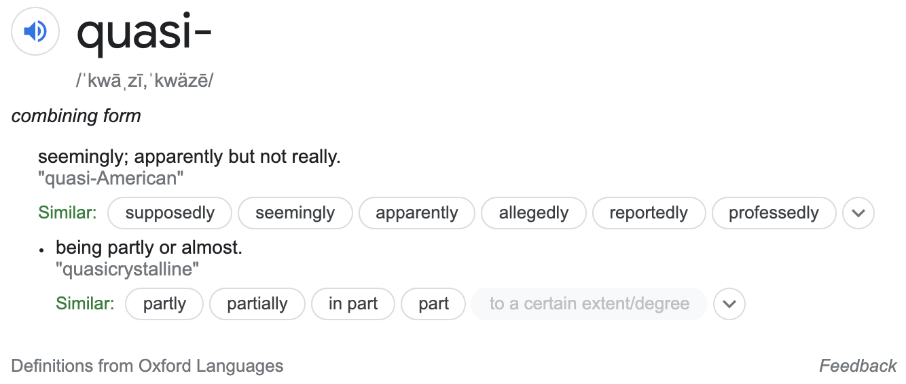

```{r setup, include=FALSE}
# R options
options(
  htmltools.dir.version = FALSE, # for blogdown
  show.signif.stars = FALSE,     # for regression output
  warm = 1,
  crayon.enabled = FALSE
  )
# Set dpi and height for images
library(knitr)
opts_chunk$set(fig.height = 2.65, dpi =300, warning=FALSE, message=FALSE) 
# ggplot2 color palette with gray
color_palette <- list(gray = "#999999", 
                      salmon = "#E69F00", 
                      lightblue = "#56B4E9", 
                      green = "#009E73", 
                      yellow = "#F0E442", 
                      darkblue = "#0072B2", 
                      red = "#D55E00", 
                      purple = "#CC79A7")

library(tidyverse)
library(gridExtra)
htmltools::tagList(rmarkdown::html_dependency_font_awesome())
### xaringan::inf_mr() -> use this for display within Rstudio

xaringanExtra::use_share_again()
xaringanExtra::style_share_again(
  share_buttons = "none"
)

htmltools::tagList(
  xaringanExtra::use_clipboard(
    button_text = "<i class=\"fa fa-clipboard\"></i>",
    success_text = "<i class=\"fa fa-check\" style=\"color: #90BE6D\"></i>",
    error_text = "<i class=\"fa fa-times-circle\" style=\"color: #F94144\"></i>"
  ),
  rmarkdown::html_dependency_font_awesome()
)
```

name: topics

## Topics
You can click the following links to navigate through the slides (in the HTML version).

* [Admin notes](#admin)
* [Generalized Linear Models: A unifying theory](#unify)
* [Reading: Logistic regression](#reading-logistic)
* [Logistic regression case study: Trying to lose weight](#cs-logistic)
* [Poisson regression key concepts + reading](#reading-poisson)
* [Poisson regression case studies: (1) Household size in the Philippines and (2) Campus crime](#cs-pois)
* [Final case study + writing task: Abstract](#writing)

---
class: middle, center, inverse
name: admin
# Admin and general updates

.header[<u>[Go to topics list](#topics)</u>]

---
## Admin notes

* No weekly check-in survey last week. 
* Recordings from last weeks class available on the weekly materials page.
* Revision version of the Team Up also available now.
* Class rep meeting this Friday. 

## Student reps

.pull-left[
### L0101
__Hojung (Kane) Kim __
hojung.kim@mail.utoronto.ca
] .pull-right[
### L0201
__Varun Lodaya__
varun.lodaya@mail.utoronto.ca
]

---
## Reading week lite?

I've been thinking a lot about what students have been saying about about workload and well-being while learning online. Due to the change in Winter semester dates, there are 7 weeks after reading week and then pretty much straight on to the final assessment period. Even under normal circumstances, that's a pretty tough set-up. We also have a Daylight savings time change coming (2:00 a.m. ET on Sunday, March 14), which can be rough on folks.

So, all of this considered, I've decided to do something a little different with week 9, that I am calling 'reading week lite'. I'm hoping it will give you give you all a chance to catch your breath, and perhaps provide some time to jump-start your project work, get caught up on your professional development task or catch up on some self-care. To help with this, I have invited guest speakers to each class that will be running workshops on health and well-being topics.

---
## 'Reading week lite'

.pull-left[
### There WILL (still) be:
  - a __quiz__ (revision)
  - a weekly __writing__ task
  - synchronous __classes__ on Wednesday with __guest speakers__ on wellness
]

.pull-right[
### There WON'T be:
  - a new __module__ released/any new content
  - a __Team Up!__ activity
]

### Bonus opportunity
  - Instead of a Team Up! activity you can earn a __full bonus point__ for _attending_ a class session with our guest speakers (i.e. up to 2 points for both live sessions).
  - For those who can't/don't wish to attend synchronously, you can earn a half bonus for viewing the recording of each session and submitting a short survey.
  - You can also mix and match, attend one live and one asynchronously for 1.5 points (but can't do both asynch and synch for the same talk).

---
## Upcoming assessments: weekly 

* [Week 8 quiz](https://q.utoronto.ca/courses/204826/quizzes/138615) (due Wednesday, Mar 10 at 10:00 a.m. ET)
* [Week 8 writing](https://q.utoronto.ca/courses/204826/assignments/506345)
    - Create phase due Mar 11 at 6:00 p.m. ET
    - Assess phase due Mar 12 at 6:00 p.m. ET
    - Reflect phase due Mar 15 at 6:00 p.m. ET
---
## Upcoming assessments: non-weekly 
### [Polished writing 2](https://q.utoronto.ca/courses/204826/assignments/506352) (due Mar 12 at 6:00 p.m. ET)

[Polished writing 2](https://q.utoronto.ca/courses/204826/assignments/506352) must be a response to one of the prompts from <a title="Week 4 writing" href="https://q.utoronto.ca/courses/204826/assignments/506342" data-api-endpoint="https://q.utoronto.ca/api/v1/courses/204826/assignments/506342" data-api-returntype="Assignment">Week 4 writing</a>, <a title="Week 5 writing" href="https://q.utoronto.ca/courses/204826/assignments/506343" data-api-endpoint="https://q.utoronto.ca/api/v1/courses/204826/assignments/506343" data-api-returntype="Assignment">Week 5 writing</a> or <a title="Week 7 writing" href="https://q.utoronto.ca/courses/204826/assignments/506344" data-api-endpoint="https://q.utoronto.ca/api/v1/courses/204826/assignments/506344" data-api-returntype="Assignment">Week 7 writing</a>. You do not have to have completed the activity for that week to be able to submit your response as your polished writing, but the intention is that you are submitting a piece improved based on feedback from your peers.

### Confirm project group/individual status (due Mar 19 at 6:00 p.m. ET)

More information about how to do this, and the project in general, __coming soon__. BUT you can already start thinking about if you'd like to work as a group (and if so, whom with) or an individual. 

### [Professional development evidence and reflection](https://q.utoronto.ca/courses/204826/assignments/506360) (due Apr 02 at 6:00 p.m. ET)

---
class: center, middle
## Final project

.large[More information in Wednesday class this week!]

---
## Grading updates

Remember that if you wish to request a regrade for any of the released graded assignments (polished 1, proposal, __your request must be made by Tuesday, Mar 09 at 11:00 a.m. ET to be considered__.

Grading is still underway for the __data exploration__ assessment. (Sorry, this one seems like it is going to take a while.)

Grading for the __mixed assessment__ is almost done.

---
class: middle, center, inverse
name: unify
# Generalized Linear Models: A unifying theory

.header[<u>[Go to topics list](#topics)</u>]

---
## Readings

__Reading:__ [Chapter 5](https://bookdown.org/roback/bookdown-BeyondMLR/ch-glms.html) of Roback, P. & Legler, J. Beyond Multiple Linear Regression. (2021). https://bookdown.org/roback/bookdown-BeyondMLR/.

__Optional reading:__ Wood, S.N. Generalized Additive Models: An Introduction with R, 2nd Edition. 2017. https://ebookcentral-proquest-com.myaccess.library.utoronto.ca/lib/utoronto/detail.action?docID=4862399 (requires you to log in with your UTORid)

(The chapter in Wood covers more of the theory, but use what is covered in the slides as your guide to what is assessable.)

---
## Recall

For a generalized model, we've said that:

$$Y_i \sim  \text{some distribution}(\mu_i);\ g(\mu_i) =  X_i^T\beta$$
### Exponential family forms

.midi[The first model we met in the Generalized Linear Model family was logistic regression. But! there is a whole broader extended 'family' of these models that have a unifying trait:

.center[__their probability distribution function can be expressed in exponential form:__
]

.large[$$f(y;\theta)=e^{[ [y\theta-B(\theta)]/A(\phi)+C(y, \phi)]}$$]]

where $\phi$ is an arbitrary _scale_ parameter and $\theta$ is know as the _canonical parameter_ of the distribution. Functions A, B and C are arbitrary functions.  You'll see lots of different letters and symbols used for these functions, I'm not sure which set to call the 'most' popular versions.

---
## Exponential family forms (continued)

As you'll see in this week's reading, we can also set $\phi = 1$ (or it is by default 1 for Poisson and binomial) and talk about these as members of a 'one-parameter exponential family' where you can write the probability formula like this ( $\theta$  is the 'one parameter'):

$$f(y;\theta)=e^{[a(y)b(\theta)+c(\theta)+d(y)]}$$

The canonical (also called "natural") parameter of a one-parameter exponential family is $\theta=g(\mu)$.

__Exponentials with an extra parameter__

The __Tweedie__ and __negative binomial__ distributions are also commonly employed. They can be expressed as members of the exponential family but with a single _additional_ parameter. The negative binomial is often used when we have count data that is __overdispersed__ relative to a Poisson distribution. I mostly only know Tweedie through its use by __actuaries__ and have never used it in research myself.

---
## Show that the normal distribution is in the exponential family


---
## Show that the Poisson distribution is in the exponential family

---
##  Your turn! Show that the binomial distribution is in the exponential family


---
## Canonical link functions

A link function, $g(\mu_i)$ is __canonical__ if $g(\mu_i) = \theta_i$. 

We've been using the canonical link for logistic regression, the logit link, where $g(\mu) = log(\frac{\mu}{n-\mu})$. 

There are a few nice properties that come with using the canonical link:
* They ensure $\mu$ will be in the range the outcome variable can take (e.g. no probabilities greater than 1).
* Two methods for finding the MLE, Newton's method and the Fisher scoring method, will be identical when using the canonical link.
* Residuals will sum to 0, an 'observed unbiasedness'. 
* The Hessian for the log-likelihood will be equal to its expected value.
  * The Hessian is the matrix of second derivatives of the likelihood with respect to the parameters. 

---
## Exponential Family of Distributions

.pull-left[
* Includes most of our familiar distributions: 
  * normal, exponential, log-normal, gamma, chi-squared, beta, Bernoulli, Poisson, inverse Gaussian...and more!
* Who's _not_ in the family? 
  * Student's $t$-distribution, $F$-distribution, most distributions that are a mixture of others.
* Provides a unified theory for generalized linear models.
* A general, highly efficient method for finding MLEs numerically: Iterative weighted least squares (IRLS)
]

.pull-right[
```{r, echo=FALSE, fig.align='center', out.width="70%"}

```
]

---
## Iteratively re-weighted least squares algorithm (a sketch)

1. Start with an estimate of the mean, $\hat{\mu}_i = y_i + \delta_i$ ( $\delta_i$ is usually 0, but sometimes it is a small constant to ensure that the $g(\mu_i$) is finite).
2. Create some 'pseudodata', $z_i$, using the values from the previous step and the original data and the associated weights (there are equations for all of this, of course, but they're not being covered in this class).
3. Find the value of $\hat{\beta}$ that minimizes the weighted least squares objective, $\Sigma^n_{i = 1}w_i(z_i - \textbf{X}_i \beta)^2$.
4. Update $\theta = X\hat{\beta}$ and $\hat{\mu}_i = g^{-1}(X_i\hat{\beta})$ and start at step 2 again.

#### How do decide when to stop?

We can judge that this algorithm has converged?  One common way is checking the change in the negative log likelihood between each iteration and stopping once it is near zero (for a given value of 'nearness'.)

---
## A quick note on the large sample distribution of $\hat{\beta}$

From the properties of maximum likelihood, we have that: $\hat{\beta} \sim N(\beta, \mathcal{I}^{-1})$ or $\hat{\beta} \sim N(\beta, \hat{\mathcal{I}}^{-1})$

This isn't an exact distributional result, it relies on large sample approximations.

---
## Deviance

It is nice to be able to make comments about GLMs in a similar way we are used to talking about the residual sum of squares in ordinary linear regression.

The __deviance__ can take on this role for us. (In our R output it is called the _Residual deviance_.)

$$D = 2 \{ l(\hat{\beta}_{max}) - l(\hat{\beta)} \}\phi $$

$l(\hat{\beta}_{max})$ is the maximum likelihood of the saturated model (super overfitting, one $\beta$ per observation) and is the highest log likelihood we could possibly get with this data.

The __scaled deviance__ is $D\text{*} = D/\phi$. Once again relying on large sample results for likelihoods, we can say that if our model is true, $D\text{*} \sim \chi^2_{n-p}$.

There is also the __null deviance__, $D_0$, which is the deviance between the null model (only an intercept) and the saturated model (perfect fit, one parameter per data point).


---
## Comparing models

Suppose we're interested in testing: $\text{H}_0\text{:}\  g(\mathbf{\mu}) = \mathbf{X}_0\mathbf{\beta}_0$ vs $\ \text{H}_1\text{:}\  g(\mathbf{\mu}) = \mathbf{X}_1\mathbf{\beta}_1$

$\mathbf{\mu}$ is the expected value of our response variable (and our observations are independent), and are from the same member of the exponential family of distributions and the models are nested. (I.e., $\mathbf{X}_0 \subset \mathbf{X}_1$.)

We can show, though won't here, that we can apply the likelihood ratio test as an expression of scaled model deviances, and that $\phi$ will cancel (nice!) so that this still works for us for GLMs where our scale parameter is not known.

A note on AIC from Simon Wood: _"In some quarters AIC has acquired cult status as the one true way to model selection, in a similar way to p-values, somewhat earlier. This is unfortunate nonsense. Like p-values, AIC is useful as a rough and ready quantitative aid to selecting between models, nothing more."_

---
## Quasi-likelihood

.pull-left[
We've assumed so far that we know our response distribution to be a member of the exponential family, the whole unifying property of our GLM framework, so far.

BUT, sometimes we don't know the distribution quite so precisely. We may have a specific relationship between the mean and variance of the response in mind, but that's it.

__Is all lost?__

No! WE can actually get pretty far with the idea of **quasi-likelihood**.

]

.pull-right[
```{r, echo=FALSE, fig.align='center', out.width="90%"}

```

Our main __practical interest__ in this is that we can use it to model count data for which our variance is higher than we could get from the Poisson or binomial distributions.

Examples (family component of `glm`):  
`family = quasibinomial(link = "logit")`
`family = quasipoisson`
]

---
## So what does this whole section mean for us in practice?

.large[
* We'll use the __canonical link__ functions unless we have good reason to prefer something else (gamma is really the only example I tend to use a non-canonical link for).
* Under the hood, `glm` is making use of nice properties of our __exponential family__ and using the iteratively re-weighted least squares algorithm. 
* __Deviances__ tell us about goodness-of-fit.
* In this course, we'll use __likelihood ratio tests__ when comparing nested GLMs.
* We can (easily) use __quasi-likelihood__ methods in situations where we want to 'loosen' up our distributional assumptions.
]

---
class: middle, center, inverse
name: reading-logistic
# Reading: Logistic regression

.header[<u>[Go to topics list](#topics)</u>]

---
## Reading

.large[
__Reading:__ [Chapter 6](https://bookdown.org/roback/bookdown-BeyondMLR/ch-logreg.html) (§ 6.2, 6.4) of Roback, P. & Legler, J. Beyond Multiple Linear Regression. (2021). https://bookdown.org/roback/bookdown-BeyondMLR/.

This chapter should provide some good review of what was introduced last week about odds and logistic regression.]

---
class: middle, center, inverse
name: cs-logistic
# Logistic regression case study: Trying to lose weight

.header[<u>[Go to topics list](#topics)</u>]

---
## Case study: Trying to lose weight 

This case study is drawn from the content in [Chapter 6](https://bookdown.org/roback/bookdown-BeyondMLR/ch-logreg.html) (§ 6.7) of Roback, P. & Legler, J. Beyond Multiple Linear Regression. (2021). https://bookdown.org/roback/bookdown-BeyondMLR/.

It differs from the [__Challenger__ example last week](https://sta303-bolton.github.io/sta303_slides/sta303_w7_slides#38) in that the response is binary (0/1) instead of a number of successes out of a given number of trials. This is a really common application of these methods.

---
## Access the code for the case studies

.large[
```{r, eval=FALSE}
devtools::install_github("sta303-bolton/sta303w8")
# If it prompts you to update packages, 
# just click 'Enter' or 'Return' or input 3
```
]

Like last week, you can access R Markdown templates with the code by installing this package and then opening a new R Markdown document from template. Go to File -> New File -> R Markdown and choose 'From template' and select the case study you want to work through the code on. 

__YOU MAY NEED TO RESTART THE R SESSION FOR THE TEMPLATE TO BE AVAILBLE. Go to Session -> Restart R__

If you have trouble accessing the package, the contents of the .Rmds are available [here](https://raw.githubusercontent.com/sta303-bolton/sta303w8/main/inst/rmarkdown/templates/weight-loss/skeleton/skeleton.Rmd).

---
class: middle, center, inverse
name: reading-poisson
# Poisson regression key concepts + reading

.header[<u>[Go to topics list](#topics)</u>]

---
## Reading

.large[

You may wish to read the entire Poisson regression chapter, but I recommend you focus on these chapters at least.

__Reading:__ [Chapter 4](https://bookdown.org/roback/bookdown-BeyondMLR/ch-poissonreg.html) (§ 4.2, 4.4, 4.6, 4.7, 4.8, 4.9, 4.10) of Roback, P. & Legler, J. Beyond Multiple Linear Regression. (2021). https://bookdown.org/roback/bookdown-BeyondMLR/.]

---
## Key concepts for Poisson regression

.column[
### Use case
Counts, which can also extend to rates, i.e. counts per some unit of time or space.
]

.column[
### Assumptions
* Poisson response
* Independence
* Mean = variance
* $log(\lambda)$ is a linear function of $x$
]

.column[
### Model
.midi[
$$Y_i \sim \text{Poisson}(\lambda_i) $$
$$\log(\lambda_i) = X_i\beta$$
Canonical link: log]
]

<br><br><br><br><br><br><br><br>

.midi[
* We interpret __coefficients__ as __risk ratios__
  * Similar to logistic regression, we are interpreting the coefficients on the multiplicative scale after transforming with inverse of our link function.
* __Offsets__
  * Accounts for different denominators in rates, while allowing for counts to still be the response.
* Note: We're using 'log' here to mean the 'natural log', i.e., base _e_. `log()` in R is also base e.
]

---
## Key concepts for Poisson regression (cont.)
* __Overdispersion__
  * A key assumption of Poission regression is that the mean and variance of our response are equal. If the variance is greater than the mean we have overdispersion. 
  * If we ignore overdispersion, our standard errors might be falsely small, meaning we'll probably have falsely small p-values, which might lead us to choose an more complicated model 
* __Negative binomial regression__
  * This is another approach to dealing with overdispersion. As we've seen negative binomial isn't part of the one parameter exponential family, it requires a second parameter, but this gives us more flexibility AND assumes an explicit likelihood function (unlike quasipoisson).
* __Zero-inflated Poisson (ZIP)__
  * Some situations have two underlying processes, one that is Poisson and one that always produces zeros. 
  
---
## Zero-inflated Poisson situations

.pull-left[
```{r, echo=FALSE, fig.align='center', out.width="70%"}

```
Suppose you're modelling the fish caught by people staying at a lakeside resort. The count of fish caught will always be zero for people who don't go fishing and sometimes zero for people who do. ]

.pull-right[
```{r, echo=FALSE, fig.align='center', out.width="70%"}

```
Another common example arises with fertility data. If you have the count of live-births per person, for people who can give birth to a child, some will never have children, either by choice (e.g., through contraceptive use) or due to fertility/health status.]

---
class: middle, center, inverse
name: cs-pois
# Poisson regression case studies: (1) Household size in the Philippines and (2) Campus crime

.header[<u>[Go to topics list](#topics)</u>]

---
## Reading guides for the case studies

Read through these case studies, experiment with the code and pay particular attention to these questions.

.pull-left[
### Household size in the Philippines

- How do we interpret the coefficients?
- How do we compare models?
- What are the reasons why this model might not fit well?

You can ignore 4.4.5 and 4.4.8, if you wish.]

.pull-right[
### Campus crime .small[(includes 4.7, 4.8 and 4.9)]

- Why would we use offsets in logistic regression?
- How do we include offsets in the model in R?
- What makes us concerned about our model assumptions?
- How does this example help us account for multiple testing?
]

---
## Access the code for the case studies

.large[
```{r, eval=FALSE}
devtools::install_github("sta303-bolton/sta303w8")
# If it prompts you to update packages, 
# just click 'Enter' or 'Return' or input 3
```
]

Like last week, you can access R Markdown templates with the code by installing this package and then opening a new R Markdown document from template. Go to File -> New File -> R Markdown and choose 'From template' and select the case study you want to work through the code on. 

__YOU MAY NEED TO RESTART THE R SESSION FOR THE TEMPLATE TO BE AVAILBLE. Go to Session -> Restart R__

If you have trouble accessing the package, the contents of the .Rmds are available here: (1) [Household size in the Philippines](https://raw.githubusercontent.com/sta303-bolton/sta303w8/main/inst/rmarkdown/templates/philippines/skeleton/skeleton.Rmd) and (2) [Campus crime](https://raw.githubusercontent.com/sta303-bolton/sta303w8/main/inst/rmarkdown/templates/campus-crime/skeleton/skeleton.Rmd)

---
class: middle, center, inverse
name: writing
# Final case study + writing task: Abstract

.header[<u>[Go to topics list](#topics)</u>]

---
## Writing an abstract

In Week 5, you wrote the results and conclusion for an abstract for the lung function study. The week, you are going to write the __full abstract__ for the [weekend drinking case study](https://bookdown.org/roback/bookdown-BeyondMLR/ch-poissonreg.html#cs:drinking) in Roback and Legler. Full prompt and instructions on [Quercus](https://q.utoronto.ca/courses/204826/assignments/506345).

.footnote[[Chapter 4.10](https://bookdown.org/roback/bookdown-BeyondMLR/ch-poissonreg.html#cs:drinking) of Roback, P. & Legler, J. Beyond Multiple Linear Regression. (2021).]

All relevant code is available in a template called 'Case study weekend drinking' from the `sta303w8` package ([contents available here, also](https://raw.githubusercontent.com/sta303-bolton/sta303w8/main/inst/rmarkdown/templates/weekend-drinking/skeleton/skeleton.Rmd))

Your abstract should be organised into the following sections:
* __Background & Aim__	(_What do we know about the topic? What is this study about?_),
* __Methods__ (_How was it done?_),
* __Results__	(_What was discovered?_), and 
* __Conclusions__ (_What do the findings mean?_).


---
class: inverse, middle

# See you Wednesday for class!

.header[<u>[Go to topics list](#topics)</u>]

```{r eval = FALSE, echo = FALSE}

pagedown::chrome_print("sta303_w8_slides.html", wait = 20)

```
