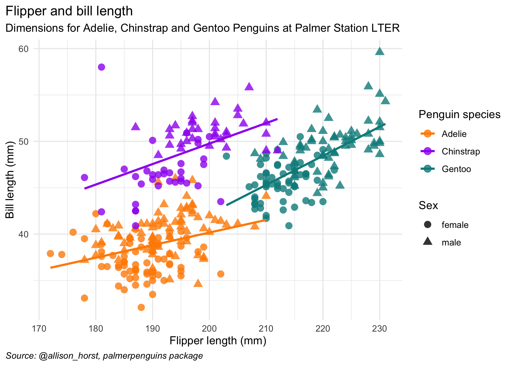

```{r setup, include=FALSE}
# R options
options(
  htmltools.dir.version = FALSE, # for blogdown
  show.signif.stars = FALSE,     # for regression output
  warm = 1,
  crayon.enabled = FALSE
  )
# Set dpi and height for images
library(knitr)
opts_chunk$set(fig.height = 2.65, dpi =300, warning=FALSE, message=FALSE) 
# ggplot2 color palette with gray
color_palette <- list(gray = "#999999", 
                      salmon = "#E69F00", 
                      lightblue = "#56B4E9", 
                      green = "#009E73", 
                      yellow = "#F0E442", 
                      darkblue = "#0072B2", 
                      red = "#D55E00", 
                      purple = "#CC79A7")
# For nonsese...
#library(mdsr)
#library(emo)
library(tidyverse)
#library(gridExtra)
htmltools::tagList(rmarkdown::html_dependency_font_awesome())
### xaringan::inf_mr() -> use this for display within Rstudio

xaringanExtra::use_share_again()
xaringanExtra::style_share_again(
  share_buttons = "none"
)

htmltools::tagList(
  xaringanExtra::use_clipboard(
    button_text = "<i class=\"fa fa-clipboard\"></i>",
    success_text = "<i class=\"fa fa-check\" style=\"color: #90BE6D\"></i>",
    error_text = "<i class=\"fa fa-times-circle\" style=\"color: #F94144\"></i>"
  ),
  rmarkdown::html_dependency_font_awesome()
)
```

name: topics

## Topics
You can click the following links to navigate through the slides.

- [Administrative and logistical information](#admin)
- [Review of linear regression](#linearmods)
- [Penguins: The data for this week](#penguins)
- [Contrasts](#contrasts)
- [Common statistical tests as linear regression](#tests)
- [Reproducible examples (reprex)](#reprex)

---
class: middle, center, inverse
name: admin
# Welcome and course admin

.header[<u>[Go to topics list](#topics)</u>]

---
## Instructor: Prof. Liza Bolton

.left-column[

You can call me:
- **Prof. Bolton** (like "bowl" `r emo::ji("bowl")` and "ton" `r emo::ji("weight")`), or 
- **Liza** (like "lie" (to tell a lie `r emo::ji("lie")`) and "zah" (like the end of Pizza `r emo::ji("pizza")`)).


(Names are important, if I'm saying yours incorrectly, please tell me!)

I have taught STA303 before, but have made quite a few changes for online learning that I hope you'll benefit from.

You can read the rest of my welcome, and meet our head TA Amin, in the ['How this course works' module](https://q.utoronto.ca/courses/204826/pages/nice-to-meet-you?module_item_id=2163392).
]

.right-column[
```{r, echo=FALSE, fig.align='center', out.width="100%"}

```
.center[.midi[
she/her
<br>
[sta303@utoronto.ca](mailto:sta303@utoronto.ca)
<br><br>
**Office hours**: Wednesdays 1:10—2:00 p.m. ET and 4:10—5:00 p.m. ET
]]

]

---
## To do this week

.pull-left[
#### The full list
.midsmall[
- Work through the [**'How this course works' module**](https://q.utoronto.ca/courses/204826/pages/nice-to-meet-you?module_item_id=2163392).
  - Most importantly:
      - Read [this overview of the course](https://q.utoronto.ca/courses/204826/pages/how-this-course-works?module_item_id=1715900)
      - Read the [Syllabus](https://q.utoronto.ca/courses/204826/assignments/syllabus)
      - Join [Piazza](piazza.com/utoronto.ca/winter2021/sta303h11002hs)
      - Checkout the [RStudio on the JupyterHub](https://rstudio-with-jupyerhub-uoft.netlify.app/#1)
      - Set up your [U of T Zoom account](https://q.utoronto.ca/courses/204826/pages/join-synchronous-class?module_item_id=1715906) (required)
- Work through the [**Week 1 module**](https://q.utoronto.ca/courses/204826/pages/w1-outcomes-and-activities?module_item_id=2175713)
  - [Week 1 quiz](https://q.utoronto.ca/courses/204826/quizzes/138607) (officially due Tuesday, Jan 12 at 6:00 p.m. ET, but available until Jan 26 with no penalty)
  - [Attend class](https://q.utoronto.ca/courses/204826/pages/join-synchronous-class?module_item_id=1715906) / watch [recording](https://q.utoronto.ca/courses/204826/pages/course-overview) (when posted)
  - [Week 1 writing](https://q.utoronto.ca/courses/204826/assignments/506333) (3 phases, first is the create phase due Thursday, Jan 14 at 6:00 p.m. ET)
]]

.pull-right[
#### The ''Week 1 has too much admin reading in all my classes, please tell me the absolute minimum I can do, I promise to catch up later" list
.midi[
- Read the [Syllabus](https://q.utoronto.ca/courses/204826/assignments/syllabus)
- [Week 1 writing](https://q.utoronto.ca/courses/204826/assignments/506333) (3 phases, first is the create phase due Thursday, Jan 14 at 6:00 p.m. ET)
- [Attend class](https://q.utoronto.ca/courses/204826/pages/join-synchronous-class?module_item_id=1715906) (will need U of T Zoom account) / watch [recording](https://q.utoronto.ca/courses/204826/pages/course-overview) (when posted)
<br>
<br>
Not advised, obviously, but I hope this helps if you're feeling a little overwhelmed.
]]

---
## Assessment

You can see the full assessment schedule in the [Syllabus](https://q.utoronto.ca/courses/204826/assignments/syllabus).

Assessments you can already start working on:
- [Week 1 quiz](https://q.utoronto.ca/courses/204826/quizzes/138607) (officially due Tuesday, Jan 12 at 6:00 p.m. ET, but available until Jan 26 with no penalty)
- [Week 1 writing](https://q.utoronto.ca/courses/204826/assignments/506333) (Create phase due Thursday, Jan 14 at 6:00 p.m. ET)

- [Professional development task](https://q.utoronto.ca/courses/204826/pages/professional-development) (Proposal due Friday, January 29 at 6:00 p.m. ET)


---
## Upward management

.midi[
'Upward management' is basically managing your manager. If you make their life easier and help them be more effective, this should also make *your* life easier and is a good investment in your own career and skills building.

While our course isn't a business, some of the basic parts of this concept apply well to your time at university AND can set you up for success in graduate studies and your future career.

**But why should you put effort into upward managing me?** Well, while I will always seek to treat all students fairly and to listen to your feedback, YOU can make this easier or harder for me, and thus make this course better or worse for yourselves. 

For example, if I have to use all my time and energy following up on unclear emails for more information and dealing with students who haven't followed instructions etc. etc....I won't have that energy to put into the 'extras', like writing Team Up! activities to give you extra practice and opportunities to earn bonus points.]

.footnote[*I used to haaaate this concept because I first learned it while doing a consulting internship at a large international professional services firm. I didn't enjoy the internship at all, but I still learned a lot.*]

---
### Upward management tip: Communicate using the tools your manager prefers.  
* **In business**, this means knowing who likes face-to-face vs email, or whether your manager would rather receive an instant message than an email for a quick question.
* **In STA303**, this means: 
  - Using Piazza for all course admin and content questions.
  - Using the appropriate forms for accommodations and regrade requests.
  - Emailing **sta303@utoronto.ca** for private issues not otherwise covered by the other tools, e.g. emailing me your Accommodation Services letter, requesting an extension to an assessment that conflicts with essential travel.
  - Asking questions in office hours.
  
---
### Upward management tips: Write good emails (when emails are appropriate)
.pull-left[
.midi[
- **In business**, this might mean:
  - Choosing who should be the main recipients vs CCed/BCCed. 
  - Ensuring your contact details are clear in your signature.
  - Make sure the subject line is informative and short
  - Making the text of the email as clear and concise as possible.
  - Use proper grammar and punctuation. 
  - Don't use emoji in formal emails. If in doubt, leave 'em out.]]
.pull-right[.midi[
- **In STA303**, this looks like:
  - Everything in the right-hand column, plus the following.
  - Starting an email with "Hi Prof. Bolton," or "Hi Liza,".[1]
  - Sign off the email with your **preferred name** (i.e. what should I call you when I reply) and if your have different official name, include that and your UTORid below your name.
  - Subject line including [Prof. Bolton] or [TA name] if your email is for a specific person.
]]

.footnote[.small[ [1]"Dear Madam" and "To my esteemed professor" make me uncomfortable...]]

---
### Upward management tips: Understand your manager's goals.
- **In business**, this might look like understanding their KPIs and how you can help make sure these are met.
- **In STA303**, most of *my* goals are *for you*, like that you learn useful statistical skills, improve your writing skills etc. I also personally want to improve as an instructor and have fun talking about something I love. 
  - You can help me with these goals by working on this course every week, trying your best, asking for help early and often, engaging with feedback gathering mechanisms and providing constructive feedback if something is not working.

---
### Upward management tips: Demonstrate self-management and resilience while also asking for help and flagging problems early. 
.midsmall[
- **In business**, this might look like:
  - Being proactive about addressing possible problems before they occur. Managers like a 'no surprises' policy.
  - Preparing a list of questions to cover in a meeting or to compile in an organised fashion into one email (instead of ten). 
  - Searching for answers yourself before asking your manager and improving your strategies for finding available information.

- **In STA303**, this looks like:
 - Putting in a little effort into find answers before posting on Piazza/asking in class 
      - *Have you searched Piazza? Have you re-read/watched the assigned materials? Have your checked the syllabus and recent announcements?*
 - Coming to office hours often, lists of questions very welcome!
 - Getting in touch (or asking your registrar to) **early** if you might have to miss a lot of class. It is usually easier to find a solution if I know things ahead of time, or as soon as possible after.
]
---
## FAQ

.small[[Piazza](piazza.com/utoronto.ca/winter2021/sta303h11002hs/home) is our 'live' Q&A board, but I will also be updating a more static [FAQs on Quercus](https://q.utoronto.ca/courses/204826/pages/faq)]

.midsmall[
.pull-left[
**References**  
*Can you write me a reference? I'm desperate!*  
If this is the first time I've been your instructor, please do not ask me for a reference during this semester. I know some of you might be really struggling to get enough right now, but even if I could accept more at this stage, I do not write for students who haven't completed a course with me.

**Research opportunities and other employment**  
*Do you have any research opportunities available?*  
Not currently, but I will promote Research Assistant (RA) and Teaching Assistant (TA) roles in class notices/announcements if/when they come up.

]

.pull-right[
**Reading courses**  
*I want to do a reading course in Stats, can you supervise me?*  
I am not accepting more students for reading courses this semester or during Spring/Summer 2021. I won't be considering applicants for Fall 2021 until August. If you're interested in doing a reading course (which are awesome!) I hope you will approach other Profs in the department! [There is more information about reading courses on our website.](https://www.statistics.utoronto.ca/current-students/special-enrolment-courses-sta490y1-sta492h1-and-sta496h1sta497h1#several-statistics-courses-have-special-enrolment-procedures-so-enrolment-in-these-courses-cannot-be-done-on-acorn-please-select-the-course-you-are-interested-in-from-the-list-below-for-information-on-the-enrolment-process-prerequisites-and-instructions-on-how-to-request-enrolment-accordion-3)


**STA303 pre-requisites**  
*I didn't take STA302 or an equivalent course, can I still take STA303?*  
No, sorry. We enforce pre-reqs strictly. This isn't up to me.
]]

---
class: middle, center, inverse
name: linearmods
# Review of linear regression

.header[<u>[Go to topics list](#topics)</u>]

---

## Why model?
.large[&nbsp;&nbsp;&nbsp;&nbsp;&nbsp;&nbsp;&nbsp;&nbsp;&nbsp;&nbsp;&nbsp;&nbsp;&nbsp;&nbsp;&nbsp;&nbsp;&nbsp;&nbsp;&nbsp;&nbsp;&nbsp;&nbsp;&nbsp;&nbsp;&nbsp;&nbsp;&nbsp;&nbsp;&nbsp;*All models are wrong...*

.right[*...but some are useful.*&nbsp;&nbsp;&nbsp;&nbsp;&nbsp;&nbsp;&nbsp;&nbsp;&nbsp;&nbsp;&nbsp;&nbsp;&nbsp;&nbsp;&nbsp;&nbsp;&nbsp;&nbsp;&nbsp;&nbsp;&nbsp;&nbsp;&nbsp;&nbsp;&nbsp;&nbsp;&nbsp;&nbsp;&nbsp;]

.right[-George Box&nbsp;&nbsp;&nbsp;&nbsp;&nbsp;&nbsp;]
- The goal of a model is to provide a (relatively) simple summary of a dataset.
- Our goal might be to **describe** data, to make **inferences** about a population or to make **predictions** about the future.
]

---
## Linear models 
.middle[
.large[
In a linear model, 

$$y_i = \beta_0 + \beta_1x_{1i} + ... + \beta_px_{pi} + \epsilon_i$$

The response is predicted by a linear function of
explanatory (or predictor) variables plus an error term.

]
]

a.k.a.
# .center[DATA = MODEL + ERROR]

---

## Linear regression assumptions

**L**: your model is **L**inear.

**I**: Errors are **I**ndependent (usually satisfied if observations are independent).

**N**: Errors are **N**ormally distributed  with expected value zero, $E[\epsilon_i]=0$


**E**: **E**qual/constant variance (homoscedasticity), $\text{var}[\epsilon_i] = \sigma^2$.

<br>
We can express "I", "N" and  "E" above as assuming the errors are i.i.d Normal with mean of zero and variance $\sigma^2$, 
$$\epsilon_i \sim N(0, \sigma^2)$$

---
## What makes it a _linear_ model?

A model is **linear** if it is *linear in the parameters*. That is, all the $\beta$ enter the model in a linear way. It is totally fine if the predictor variables enter the model in a non-linear way.

#### Linear
- $y_i = \beta_0 + \beta_1x_i + \beta_2x_i^2 + \epsilon_i$  
- $y_i = \beta_0 + γ_1δ_1x_{1i} + \beta_2\exp(x_{2i}) + \epsilon_i$

#### NOT linear
- $y_i = \beta_0 + \beta_1x_i^{\beta_2} + \epsilon_i$  
- $y_i = \beta_0 exp(\beta_1x_{1i}) + \epsilon_i$

.footnote[Internally screaming "DON'T LET THE BETAS TOUCH" often helps me remember what is not linear. Additionally, don't let them do anything _weird_, like get exponentiated.]

---
## Optional refresher reading

.midi[
#### Brief discussion of assumptions with examples
Section 1.3 of *Broaden your Statistical Horizons* on the assumptions of OLS
https://bookdown.org/roback/bookdown-bysh/ch-MLRreview.html#ordinary-least-squares-ols-assumptions
 [freely accessible]
 
#### Fitting linear models in R
Section 1.6 of *Broaden your Statistical Horizons* on Multiple linear regression (bootstrapping not assessed) https://bookdown.org/roback/bookdown-bysh/ch-MLRreview.html#multreg [freely accessible]

#### Delicious mathematics

Chapter 1 of *Wood, S. N. (2017). Generalized additive models : An introduction with r, second edition*
http://go.utlib.ca/cat/13435628 [you will need to log in to the U of T library for access]
]
---
class: middle, center, inverse
name: penguins
# Penguins: The data for this week

.header[<u>[Go to topics list](#topics)</u>]

---
## The data for Week 1

.left-column[

The data we'll be looking for the next few sections of this week is from the `palmerpenguins` package by Allison Horst.

```{r}
# install.packages("palmerpenguins")
library(palmerpenguins)
```


```{r, echo=FALSE, fig.align='center', out.width="70%"}
include_graphics("images/lter_penguins.png")
```
.footnote[Artwork by @allison_horst]


]

.right-column[
<br>
<br>
```{r, echo=FALSE, fig.align='center', out.width="100%"}
include_graphics("images/pengwings.gif")

```
]

---

## Let's meet the penguins 

.midsmall[
```{r, message=FALSE}
library(tidyverse)

glimpse(penguins, width = 80) # width here just influences how this is displayed on my slide
```

The `glimpse` function comes from the `tibble` package, which is in loaded by the `tidyverse` package.

One of the most common issues students encounter when learning R is that they are trying to use functions that they haven't installed or loaded the package for. Make sure you've read the [slides about RStudio on the JupyerHub](https://q.utoronto.ca/courses/204826/pages/course-tools#jupyter) because packages you install there will need to be **reinstalled each session** if they are not the list of automatically available ones. 
`tidyverse` is automatically available so you only need to run `library(tidyverse)` or use the namespace for the function `tibble::glimpse()`. 
]

---
## The variables

I think most of the variables here are clear from their names. In particular, we will be interested in `species`, which has three levels (`r unique(penguins$species)`), `sex`  (`r unique(penguins$sex)`), `body_mass_g` (body mass in grams) and `flipper_length_mm` (length of their flippers measure in mm). We're not using the variables about the bills, but I thought this diagram was interesting anyway.

```{r, echo=FALSE, fig.align='center', out.width="60%"}
include_graphics("images/culmen_depth.png")
```
.footnote[Artwork by @allison_horst]

---

.left-column[
```{r, echo=FALSE}
flipper_bill <- penguins %>% 
  filter(!is.na(sex)) %>% 
  ggplot(aes(x = flipper_length_mm,
                             y = bill_length_mm)) +
  geom_point(aes(color = species, 
                 shape = sex),
             size = 3,
             alpha = 0.8) +
  geom_smooth(method = "lm", se = FALSE, aes(color = species)) +
  theme_minimal() +
  scale_color_manual(values = c("darkorange","purple","cyan4")) +
  labs(title = "Flipper and bill length",
       subtitle = "Dimensions for Adelie, Chinstrap and Gentoo Penguins at Palmer Station LTER",
       x = "Flipper length (mm)",
       y = "Bill length (mm)",
       color = "Penguin species",
       shape = "Sex",
       caption = "Source: @allison_horst, palmerpenguins package") +
  theme(
        legend.background = element_rect(fill = "white", color = NA),
        plot.title.position = "plot",
        plot.caption = element_text(hjust = 0, face= "italic"),
        plot.caption.position = "plot")
ggsave("images/ah_plot.png", flipper_bill, width = 7, height = 5)
```

```{r, echo=FALSE, fig.align='center', out.width="90%"}

```
]

.right-column[
Here are all our variables of interest in one plot.

Note: In  this chart and in future analyses involving `sex`, penguins with an unknown sex have been removed.
]

---
class: middle, center, inverse
name: contrasts
# Contrasts

.header[<u>[Go to topics list](#topics)</u>]

---
## The matrices we use for linear regression

Recall that we can express our linear regression in matrix form: 

$$\mathbf{y} = X\boldsymbol\beta + \boldsymbol\varepsilon$$

where
.pull-left[
.small[
$$
\mathbf{y} = \begin{pmatrix} 
          y_1 \\\ 
          y_2 \\\ 
          \vdots \\\ 
          y_n 
          \end{pmatrix} ,
$$
$$
 \boldsymbol\beta = \begin{pmatrix} \beta_0  \\\ \beta_1  \\\ \beta_2  \\\ \vdots  \\\ \beta_p \end{pmatrix}, \quad
 \boldsymbol\varepsilon = \begin{pmatrix} \varepsilon_1  \\\ \varepsilon_2  \\\ \vdots  \\\ \varepsilon_n \end{pmatrix}
$$
]]

.pull-right[
.midsmall[and 
$$X = \begin{pmatrix} \mathbf{x}^\mathsf{T}_1 \\ \mathbf{x}^\mathsf{T}_2 \\ \vdots \\ \mathbf{x}^\mathsf{T}_n \end{pmatrix}
 = \begin{pmatrix} 1 &  x_{11} & \cdots & x_{1p} \\
 1 & x_{21} & \cdots & x_{2p} \\
 \vdots & \vdots & \ddots & \vdots \\
 1 & x_{n1} & \cdots & x_{np}
 \end{pmatrix}$$

We often talk about **X** as the **model matrix** and it will be the focus of this section. 
 
]]

---
## Getting our model matrix in R

Let's start by fiting a model with `body_mass_g` as the response and `flipper_length_mm` and `species` as the predictor variables.

```{r}

```


.footnote[Users of statistics use a lot of different words to refer to the same thing. Can you think of other terms people might use instead of _response_ and _predictor_?]


---
class: middle, center, inverse
name: tests
# Common statistical tests as linear regression

.header[<u>[Go to topics list](#topics)</u>]

---
## Statistical tests

You have probably encountered several statistical tests in your studies so far. 

.pull-left[
### Parametric
**E.g. one-sample t-tests, paired t-tests, two-sample t-tests, one-way ANOVA, two-way ANOVA**
Parametric tests make assumptions about the distribution of the population from which our sample data have been drawn.]

.pull-right[
### Non-parametric
**E.g. Wilcoxon signed rank, Mann Whitney-U, Kruskal-Wallace**
Non-parametric tests do not assume that our outcome is Normally distributed. They are sometimes called 'distribution-free', but note that this is because they have fewer assumptions than parametric tests, not because they have no assumptions at all.
] 

---
## Aside: But why are there two types of tests?

.left-column[
Parametric tests are more **powerful**, i.e., they have a better chance of detecting an effect if there is one there to find. So why would you ever use a less powerful test? Well, with great power comes ~~great responsibility~~ more assumptions that must be valid to proceed. 

Non-parametric tests are a great choice when your outcome is an ordinal variable, is ranks, or there are problematic outliers. 

For the purposes of this lesson, we're going to focus more on parametic tests, but also take a look at the corresponding non-parametric tests with the slight white lie that they are just ranked versions of their paramteric companions. This approach is pretty good as long as you have a reasonable sample size.
]

.right-column[
```{r, echo=FALSE, fig.align='center', out.width="100%"}
include_graphics("images/uncleben.gif")
```

.tiny[Imagine this:   
_You're on a ship trying to spot land. **Parametric** tests are the crew member with the best eyesight, but they are fussy and the conditions have to be right or they will have a breakdown._

_**Non-parametric** tests are the crew member with not quite as good eyesight, but they're more laid back about the conditions you make them work it._
]
]

---
## Null and alternative hypothesis 

.pull-left[
One-sample t-test
$$H_0: \mu = \text{hypothesized val}$$
$$H_1: \mu \ne \text{hypothesized val}$$
What are we doing? Finding the strength of evidence against the claim that the population mean is some hypothesized value. 
]
Example

Suppose exisitiing research suggests that the average weight of penguins is 4000 grams. You want to see if this makes sense for your new penguins data. 
.pull-right[
```{r}
t.test(penguins$body_mass_g, mu = 4000)
```
]

---

.footnote[.midsmall[[
Credit to **Jonas Kristoffer Lindeløv** for the excellent resource this <br>section is based on. There are more examples there than we will<br>cover in this course.](https://lindeloev.github.io/tests-as-linear/)
]]

]

---
class: inverse, middle, center
name: reprex
# Reproducible examples (reprex)

.header[<u>[Go to topics list](#topics)</u>]

---
class: inverse, middle

# See you Wednesday for a hands on session!

```{r eval = FALSE, echo = FALSE}

pagedown::chrome_print("week1_slides.html", wait = 20)

```

